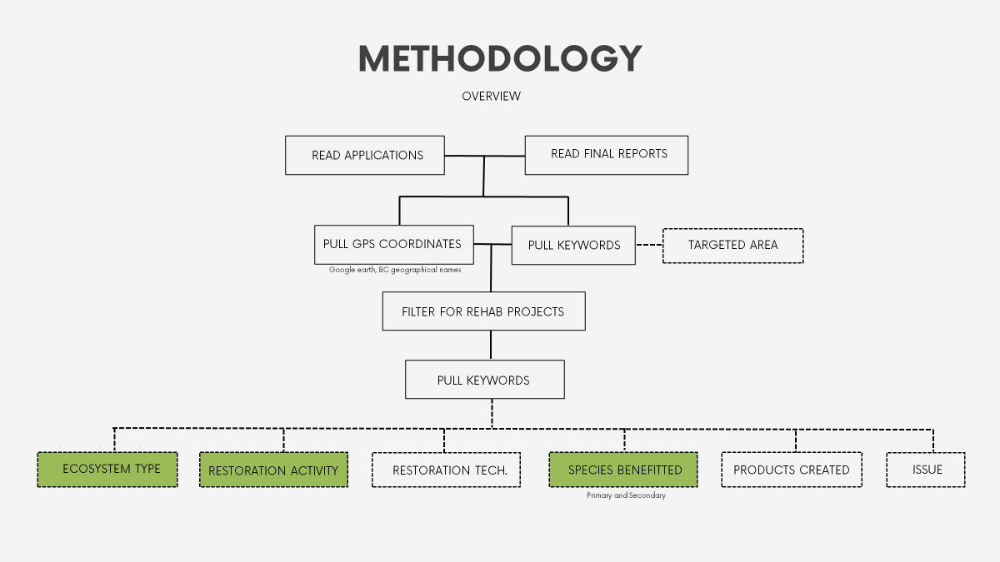

*Last edited: 25th Aug 2023*

### Summary

This document is a detailed breakdown of the methodology that was used in populating both the Community Salmon Programme (CSP) mapping project and the Restoration Atlas. Both draw from the same [<u>google spreadsheet</u>](https://docs.google.com/spreadsheets/u/3/d/1VEa7RbGrnMg_dM7CEOpanDSb1tJ-DTBHqztCA4Aq8IQ/edit). A data dictionary for all the relevant fields can be found [<u>here</u>](https://docs.google.com/spreadsheets/u/3/d/1ffB2ICuRR2o4N6sHChba7n9UV4kGA06u255f_G29Fq8/edit), and the keywords for mapping can be found [<u>here</u>](https://docs.google.com/document/u/3/d/1hD0YNZmFlQ6AITs9SCAmnYA-gaEHIbB1aFTT3aBi1ig/edit). This list is a collaborative effort mainly between Sarina, Ben and I, though there has been some input from other parties such as Isobel, Jim and DFO.

**<u>General</u>**

The starting point for both the CSP mapping project and Restoration Atlas is drawing data from the CSP grant applications and final reports. Locate these through the following steps

- Connect to the PSF VPN servers

- Access the 001 Community Salmon (CSP) folder on the Project drive

- Access FUNDING ROUNDS PROJECTS BY YEAR and find the application within the desired year

If you cannot access the VPN, [<u>here</u>](https://drive.google.com/open?id=1MHiLOkMIA9d8sKXkEXNVx17-eaXsta4b) is a google folder which should have most of the files for 2021-2015 which was compiled by Sarina.

Most of the keywords (apart from GPS coordinates and Species Benefitted) will be pulled from the text box answers.

### CSP mapping 

Main job tasks: Populate the *Lat Long* fields and *Targeted Area*.

##### Steps (Lat long): 

- Read the application and the associated final report (if available).

- Go to the project location. There should be GPS coordinates here which can be directly copied and pasted into the main spreadsheet in the associated Lat Long fields provided they are in decimal degrees. If there are no GPS coordinates go to troubleshooting.

**QC:**

- I like to check all GPS coordinates in google maps (even if provided by proponents) to make sure they’re directing us to the right location. This includes coordinates provided by BC Geographical names. To me the coordinates make sense if it’s in the right city and aligns with other contextual information in the application (it’s near a stream for a project with in-stream rehab objectives).

**Troubleshooting:**

- If no GPS coordinates are provided, or if the provided coordinates are clearly wrong (they direct you to the middle of the pacific ocean), and the given location is very vague (e.g Fraser River) read through the rest of the application/final report for contextual clues. Contextual clues can include

  - *Under project summary / methods / rationale:* nearby streams.

  - *Under project summary / rationale:* atmospheric events. Will most likely run into this if the application is for structural repairs for things such as fishways or fish ladders. If it was a big enough event, might be able to find news reports covering the damaged structure which can give more accurate geographical information.

Sometimes you might just have to google the project on google, there may be news reports about it.

- If the given location is a creek/stream that isn’t on google maps, try inputting it into the [<u>BC geographical names platform</u>](https://apps.gov.bc.ca/pub/bcgnws/web/). If you still can’t find it, google it. *(I have found directions to the location on a random governmental site before through this method)*

- If the project area is very broad (e.g the whole of BC), choose the approximate central location.

- If it’s impossible to find any information to pinpoint where the project is occurring, use the mailing address provided in the proponent information. This is the last resort.

  - If a PO box is used and there is no other identifying geographic data on the organisation website, try to use a nearby landmark. (like the government building in the community)

    - This should only happen for very small and rural communities

##### Targeted Area 

- Read the application and the associated final report (if available).

- Go to Expected Results and Methods first as they are usually more specific to the project at hand. Check to see which areas/habitats they’re working on and use the keyword list to guide selection of these areas.

  - E.g Proponents expect to remove invasive himalayan blackberry in the riparian area and install 3 riffles instream =\> Targeted area: instream, riparian

- If there isn’t enough information within these sections, I find that reading through the application in this order (project summary, project rationale, budget information, feasibility, risk, volunteerism, support, supporting documents) usually helps.

- If struggling to decide which targeted area to pick based on the keyword list, there are separate google sheets within the CPS mapping database for each keyword category. This should guide you in choosing which targeted area to pick based on the provided information. I have also provided some relevant links below. These were sites / guides that I drew upon when compiling the keyword list.

### Restoration Atlas 

Main job tasks: Populate the *Ecosystem Type, Restoration Activity, Restoration Technique, Species Benefited, Products Created* and *Issue*.

The methodology is quite similar to that utilised for the CSP mapping. A flowchart is provided below for your reference. The targeted area keyword is pulled first because it’s relevant for both CSP mapping and the Restoration Atlas. Filtering for rehab projects is done within the spreadsheet itself for the project type column. The keyword categories highlighted in green are the most aligned with [<u>DFO’s data dictionary</u>](https://docs.google.com/spreadsheets/u/0/d/15L1_6R_m90R_3_q-iL1JwI-od-HNBjq6/edit) (located in this folder).

Generally, the methodology for pulling each of these keywords would be much the same. Read the report and the final report, going through section by section to identify the keywords from the descriptive text answers. You might have to go back and forth through the document, but below I provide the places I look to first for each keyword category as well as some notes.

<u>Ecosystem type</u>

- Project summary, expected results, methods, rationale

<u>Restoration activity and Restoration Technique</u>

- Project summary, methods, expected result, budget, stage tasks, feasibility, risk, rationale, supporting documents

- Restoration technique:

  - Bioengineering: There are a multitude of bioengineering techniques. Usually I take the application and final report at face value when they mention what bioengineering technique will be utilised (e.g hydroseeding or use of geotextiles). If it helps, you can follow [<u>this document</u>](https://www.for.gov.bc.ca/hfd/library/documents/bib16124.pdf) I found which categorises the techniques as such

    - Surface protection methods (covering methods)

    - Stabilisation methods using live materials

    - Methods combining dead and live material (dead material can include rocks and dead branches)

    - Supplementary methods

    - Support structures using non-living material

  - If it falls within any of these categories, you can be fairly confident that the proponents are using bioengineering.

<u>Species Benefitted</u>

- Target species, rationale, expected result, methods, supporting documents

<u>Products Created</u>

- Project summary, expected results, methods, stage tasks, public awareness, volunteerism

<u>Issues</u>

- Project summary, methods, expected result, budget, stage tasks, feasibility, risk, rationale, supporting documents (honestly everywhere)

Things to keep in mind as you’re going through the document

- The project summary and expected result can be very descriptive and function more as a wish list. If possible, try to correlate keywords identified in these sections with keywords identified in the budget section to see what was actually funded. If a final report is available, check to see what was actually completed.

- Some keyword categories are nested. Start with the most specific keyword and then work your way up to higher levels depending on the quality of information.

- Ultimately this is a subjective process. Choose whichever keywords you feel are the best fit based on the information that you have.

- Make a note of which application is still missing its final report as you go through (flag them in the final reports column)

**Troubleshooting**

- If confident that none of the keywords in the keyword list fit, make an informed decision to add a new keyword. The list is still very much a work in progress. If unsure, consult Sarina (CSP programme).

  - This does not apply for the keyword categories Ecosystem Type and Restoration Activity as these are lifted directly from the [<u>DFO data dictionary</u>](https://docs.google.com/spreadsheets/u/0/d/15L1_6R_m90R_3_q-iL1JwI-od-HNBjq6/edit).

**Others**

- I’ve annotated a [<u>sample application</u>](https://drive.google.com/open?id=1GvWhkow8QSZfiuxpb40IABWNS1KRT227) as an example of my process. You can also find it in this folder under the title “Sample Annotation”. The highlighting legends are as follows

  - Light green: Lat Long

  - Dark green: Species benefitted

  - Blue: Restoration activity, Restoration Technique

  - Purple: Products created

  - Orange: Targeted areas, Ecosystem type

  - Red: Issue

### Next steps 

- Look at the final reports for 2021 to 2015.

  - I had problems accessing the VPN which slowed down this process considerably.

- Finish inputting the keywords up until 2015

- Create drop-down lists in the spreadsheet that allows for multiple selections

  - Speak to Ben Skinner about this

- All cells highlighted in yellow in the google mainsheet are flagged cells with issues that need to be addressed. There should be a comment attached to at least one of the cells within the flagged row explaining the issue.

### Relevant links 

##### CSP spreadsheet: [<u>https://docs.google.com/spreadsheets/d/1VEa7RbGrnMg_dM7CEOpanDSb1tJ-DTBHqztCA4Aq8IQ/edit?usp=sharing</u>](https://docs.google.com/spreadsheets/d/1VEa7RbGrnMg_dM7CEOpanDSb1tJ-DTBHqztCA4Aq8IQ/edit?usp=sharing)

- Data dictionary: [<u>https://docs.google.com/spreadsheets/d/1ffB2ICuRR2o4N6sHChba7n9UV4kGA06u255f_G29Fq8/edit?usp=sharing</u>](https://docs.google.com/spreadsheets/d/1ffB2ICuRR2o4N6sHChba7n9UV4kGA06u255f_G29Fq8/edit?usp=sharing)

- Targeted Areas:

  - Wetlands

    - [<u>https://www2.gov.bc.ca/assets/gov/environment/natural-resource-stewardship/best-management-practices/wetland_ways_ch_1_introduction.pdf</u>](https://www2.gov.bc.ca/assets/gov/environment/natural-resource-stewardship/best-management-practices/wetland_ways_ch_1_introduction.pdf)

  - Riparian

    - [<u>https://www2.gov.bc.ca/gov/content/industry/forestry/managing-our-forest-resources/silviculture/silvicultural-systems/silviculture-guidebooks/riparian-management-area-guidebook</u>](https://www2.gov.bc.ca/gov/content/industry/forestry/managing-our-forest-resources/silviculture/silvicultural-systems/silviculture-guidebooks/riparian-management-area-guidebook)

  - Instream, off-channel

    - [<u>https://www2.gov.bc.ca/assets/gov/environment/plants-animals-and-ecosystems/fish-data-information/fishstream.pdf</u>](https://www2.gov.bc.ca/assets/gov/environment/plants-animals-and-ecosystems/fish-data-information/fishstream.pdf)

    - [<u>https://www.env.gov.bc.ca/wld/documents/fia_docs/ree_guidelines.pdf</u>](https://www.env.gov.bc.ca/wld/documents/fia_docs/ree_guidelines.pdf)

- Restoration Technique

  - Bioengineering

    - [<u>https://www.for.gov.bc.ca/hfd/library/documents/bib16124.pdf</u>](https://www.for.gov.bc.ca/hfd/library/documents/bib16124.pdf)

    - Goldsmith, Wendi and Springer Engineering eBooks 2014 English/International. 2013. Bioengineering Case Studies: Sustainable Stream Bank and Slope Stabilization. 2014th ed. New York: Springer. doi:10.1007/978-1-4614-7996-3.

Here are some potentially informative links you might want to take a look at. To some degree or another, I drew upon them when compiling the keyword list for most of the categories.

- [<u>https://www.env.gov.bc.ca/wld/documents/fia_docs/ree_guidelines.pdf</u>](https://www.env.gov.bc.ca/wld/documents/fia_docs/ree_guidelines.pdf) : Guidelines for instream and off-channel routine effectiveness eval (REE)

- [<u>https://www.fsl.orst.edu/pnwerc/wrb/Atlas_web_compressed/3.Water_Resources/3d.off-channel%20habs_web.pdf</u>](https://www.fsl.orst.edu/pnwerc/wrb/Atlas_web_compressed/3.Water_Resources/3d.off-channel%20habs_web.pdf) : Off-channel habitats

- [<u>https://www2.gov.bc.ca/assets/gov/farming-natural-resources-and-industry/agriculture-and-seafood/agricultural-land-and-environment/environmental-farm-planning/efp-reference-guide/chapters/rg-chp9.pdf</u>](https://www2.gov.bc.ca/assets/gov/farming-natural-resources-and-industry/agriculture-and-seafood/agricultural-land-and-environment/environmental-farm-planning/efp-reference-guide/chapters/rg-chp9.pdf) : EFP ref guide water

- [<u>https://www2.gov.bc.ca/assets/gov/driving-and-transportation/transportation-infrastructure/engineering-standards-and-guidelines/environment/references/3824_culvertfishpassage_infosheet.pdf</u>](https://www2.gov.bc.ca/assets/gov/driving-and-transportation/transportation-infrastructure/engineering-standards-and-guidelines/environment/references/3824_culvertfishpassage_infosheet.pdf) : culverts and fish passage

- [<u>https://www.pac.dfo-mpo.gc.ca/pacific-smon-pacifique/science/research-recherche/cwt-mmc-eng.html</u>](https://www.pac.dfo-mpo.gc.ca/pacific-smon-pacifique/science/research-recherche/cwt-mmc-eng.html) : coded wire tagging (CWT) program (part of the Pacific Salmon treaty)

  - [<u>file:///C:/Users/slam/Downloads/Pacific-Salmon-Treaty.pdf</u>](about:blank) : Pacific Salmon Treaty as amended through June 2023

- [<u>https://www.psc.org/about-us/history-purpose/pacific-salmon-treaty/</u>](https://www.psc.org/about-us/history-purpose/pacific-salmon-treaty/) : Pacific Salmon Treaty

- [<u>https://waves-vagues.dfo-mpo.gc.ca/library-bibliotheque/41113251.pdf</u>](https://waves-vagues.dfo-mpo.gc.ca/library-bibliotheque/41113251.pdf) : Code of Practice, Clear Span Bridges

- [<u>https://www.dfo-mpo.gc.ca/species-especes/sara-lep/map-carte/index-eng.html</u>](https://www.dfo-mpo.gc.ca/species-especes/sara-lep/map-carte/index-eng.html) : Aquatic species at risk map

- [<u>https://www.cmnbc.ca/atlasgallery/stewardship-project-registry/</u>](https://www.cmnbc.ca/atlasgallery/stewardship-project-registry/) : Community mapping network

- [<u>https://maps.sogdatacentre.ca/apps/4f10f14d1a0d4563906abc11e2402bbc/explore</u>](https://maps.sogdatacentre.ca/apps/4f10f14d1a0d4563906abc11e2402bbc/explore) : SOG data Centre

- [<u>https://www2.gov.bc.ca/gov/content/industry/agriculture-seafood/programs/environmental-farm-plan</u>](https://www2.gov.bc.ca/gov/content/industry/agriculture-seafood/programs/environmental-farm-plan) : Environmental Farm Plan ref guide

- [<u>https://www2.gov.bc.ca/gov/content/industry/agriculture-seafood/programs/environmental-farm-plan</u>](https://www2.gov.bc.ca/gov/content/industry/agriculture-seafood/programs/environmental-farm-plan) : Off-Stream Cattle Watering Sites (W/o fencing) Protect Riparian Areas and Water Quality

- [<u>https://www2.gov.bc.ca/assets/gov/environment/plants-animals-and-ecosystems/fish-data-information/fishstream.pdf</u>](https://www2.gov.bc.ca/assets/gov/environment/plants-animals-and-ecosystems/fish-data-information/fishstream.pdf) : Fish-stream Identification Guidebook

- [<u>https://estuarymap.projectwatershed.ca/EcologyRestoration.html</u>](https://estuarymap.projectwatershed.ca/EcologyRestoration.html) : K'ómoks Estuary Ecology and Restoration Map

- [<u>https://www.dfo-mpo.gc.ca/fisheries-peches/aboriginal-autochtones/fsc-asr-eng.html</u>](https://www.dfo-mpo.gc.ca/fisheries-peches/aboriginal-autochtones/fsc-asr-eng.html) : Food, social and ceremonial fisheries (FSC)

- [<u>https://www.for.gov.bc.ca/hfd/pubs/docs/lmh/Lmh66/Lmh66_ch18.pdf</u>](https://www.for.gov.bc.ca/hfd/pubs/docs/lmh/Lmh66/Lmh66_ch18.pdf) : Stream, Riparian, and Watershed Restoration

- [<u>https://agupubs.onlinelibrary.wiley.com/doi/full/10.1002/2014WR016874#wrcr21631-bib-0014</u>](https://agupubs.onlinelibrary.wiley.com/doi/full/10.1002/2014WR016874#wrcr21631-bib-0014) : The Science and practice of river restoration

- [<u>https://www.sciencedirect.com/science/article/pii/S2468550X21000721#abs0010</u>](https://www.sciencedirect.com/science/article/pii/S2468550X21000721#abs0010): Retention of fin clips and fin and operculum punch marks in rainbow trout

- [<u>https://www2.gov.bc.ca/assets/gov/farming-natural-resources-and-industry/rangelands/riparian-tree-and-shrub-communities.pdf</u>](https://www2.gov.bc.ca/assets/gov/farming-natural-resources-and-industry/rangelands/riparian-tree-and-shrub-communities.pdf) : riparian-tree-and-shrub communities

- [<u>https://www.for.gov.bc.ca/hfp/publications/00077/riparian_guidelines.pdf</u>](https://www.for.gov.bc.ca/hfp/publications/00077/riparian_guidelines.pdf) : Guidelines for Riparian Restoration in BC (Recommended Riparian Zone Silviculture Treatments)

- [<u>https://mackenziedatastream.ca/explore/#/dataset/4b0b695a-496e-4b7f-b422-4ef8c23ddeaa/?ref=search&characteristic_media=undefined&characteristic_characteristic_name=Alkalinity,%20total&characteristic_method_speciation=undefined&characteristic_sample_fraction=undefined&characteristic_field=undefined&characteristic_unit=undefined&guideline=&percentiles=&chartType=scatter&tab=visualization</u>](https://mackenziedatastream.ca/explore/#/dataset/4b0b695a-496e-4b7f-b422-4ef8c23ddeaa/?ref=search&characteristic_media=undefined&characteristic_characteristic_name=Alkalinity,%20total&characteristic_method_speciation=undefined&characteristic_sample_fraction=undefined&characteristic_field=undefined&characteristic_unit=undefined&guideline=&percentiles=&chartType=scatter&tab=visualization) : DataStream (provides community groups, decision makers and researchers water quality data that is easily visualised and accessible)

- [<u>https://water.bcogc.ca/watershed</u>](https://water.bcogc.ca/watershed) : Northeast water tool

- [<u>https://www2.gov.bc.ca/assets/gov/farming-natural-resources-and-industry/agriculture-and-seafood/agricultural-land-and-environment/water/drainage-management-guide/533431-1_bio-engineering_techniques-drainage_guide_factsheet_no13.pdf</u>](https://www2.gov.bc.ca/assets/gov/farming-natural-resources-and-industry/agriculture-and-seafood/agricultural-land-and-environment/water/drainage-management-guide/533431-1_bio-engineering_techniques-drainage_guide_factsheet_no13.pdf) : Constructed Ditch Factsheet – Bioengineering techniques

- [<u>https://www2.gov.bc.ca/assets/gov/environment/plants-animals-and-ecosystems/fish-fish-habitat/fish-passage/fish-stream20crossing20web.pdf</u>](https://www2.gov.bc.ca/assets/gov/environment/plants-animals-and-ecosystems/fish-fish-habitat/fish-passage/fish-stream20crossing20web.pdf) : Fish-stream crossing guidebook.

- [<u>https://www.adfg.alaska.gov/index.cfm?adfg=sonar.sonartools</u>](https://www.adfg.alaska.gov/index.cfm?adfg=sonar.sonartools) : Alaska fisheries sonar program

##### 
