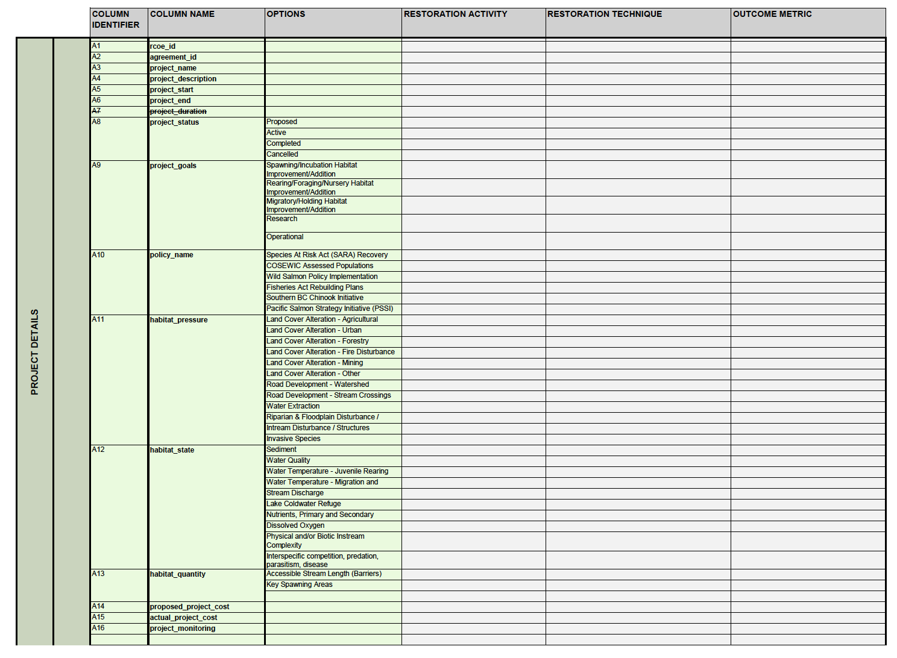
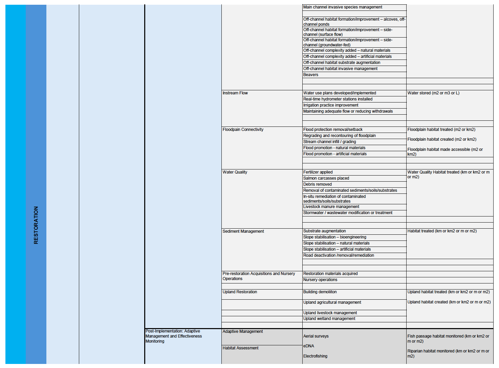

MSc Major Research Project

Final Written Report

Ben Skinner

Royal Roads University

2024-08-31

MRP Supervisor: Dr. Isobel Pearsall

Sponsor: Pacific Salmon Foundation

# 

Abstract

In British Columbia, there is a need for a digital inventory and visual interface of community led marine and estuarine salmon habitat restoration projects. Providing this technical capacity will allow for increased awareness of restoration activities, improved oversight in determining allocation of future salmon conservation efforts, and support for on-the-ground projects through increased information sharing. While the creation of such an information system is not a novel concept and has been implemented successfully for restoration projects abroad as well as in British Columbia, advances in technology and the current lack of a contemporary system provide opportunity for new research. The case study approach taken in the research will seek to design and implement components of a restoration atlas, dubbed the Community Salmon Restoration Atlas, for the Pacific Salmon Foundation’s Community Salmon Program-funded salmon related restoration projects. In showcasing select projects funded by Community Salmon Program as a starting point for a project set to continue beyond this research, this will allow for a scalable research initiative which will deliver the Community Salmon Restoration Atlas prototype. Methodologies incorporated will include a case study approach, desktop analysis of restoration reports, and GIS technologies. The final prototype will be composed of a database containing standardized salmon habitat restoration project information and a web visualization interface.

Table of Contents

[Introduction [1](#introduction)](#introduction)

[Background [1](#background)](#background)

[Context [2](#context)](#context)

[Project Purpose [2](#project-purpose)](#project-purpose)

[Project Significance [3](#project-significance)](#project-significance)

[Sponsor [4](#sponsor)](#sponsor)

[Research Methods and Design [5](#research-methods-and-design)](#research-methods-and-design)

[Research Problem Formulation and Statement [5](#research-problem-formulation-and-statement)](#research-problem-formulation-and-statement)

[Research Question [7](#research-question)](#research-question)

[Research Objectives [7](#research-objectives)](#research-objectives)

[General Approach [7](#general-approach)](#general-approach)

[Project Activities [8](#project-activities)](#project-activities)

[Objective 1 [8](#_Toc176006197)](#_Toc176006197)

[Objective 2 [9](#_Toc176006198)](#_Toc176006198)

[Objective 3 [17](#_Toc176006199)](#_Toc176006199)

[Objective 4 [21](#_Toc176006200)](#_Toc176006200)

[Ethical Considerations [22](#ethical-considerations)](#ethical-considerations)

[Analysis Activities & Findings [23](#analysis-activities-findings)](#analysis-activities-findings)

[Data and Information Analysis [23](#data-and-information-analysis)](#data-and-information-analysis)

[**Datasets** [23](#_Toc176006204)](#_Toc176006204)

[**Sampling Strategies** [25](#_Toc176006205)](#_Toc176006205)

[**Variables** [26](#_Toc176006206)](#_Toc176006206)

[**Biases** [27](#_Toc176006207)](#_Toc176006207)

[**Delimitations** [27](#_Toc176006208)](#_Toc176006208)

[**Limitations** [27](#_Toc176006209)](#_Toc176006209)

[**Analysis Findings** [28](#_Toc176006210)](#_Toc176006210)

[Contributions & Applications [33](#contributions-applications)](#contributions-applications)

[Conclusion [34](#conclusion)](#conclusion)

[References [37](#references)](#references)

[Appendices [40](#appendices)](#appendices)

[Appendix A: Sponsor Letter of Agreement [40](#appendix-a-sponsor-letter-of-agreement)](#appendix-a-sponsor-letter-of-agreement)

[Appendix B: ‘CSP Mapping’ Input Dataset. [42](#appendix-b-csp-mapping-input-dataset.)](#appendix-b-csp-mapping-input-dataset.)

[Appendix C: ‘Project Final Report Review Metrics’ Input Dataset [44](#appendix-c-project-final-report-review-metrics-input-dataset)](#appendix-c-project-final-report-review-metrics-input-dataset)

[Appendix D: Overview of DFO COE Data Standard Fields & Domains [46](#appendix-d-overview-of-dfo-coe-data-standard-fields-domains)](#appendix-d-overview-of-dfo-coe-data-standard-fields-domains)

[Appendix E: ‘CSP Mapping’ Data Dictionary [51](#appendix-e-csp-mapping-data-dictionary)](#appendix-e-csp-mapping-data-dictionary)

[Appendix F: CSP Application Form Template [53](#appendix-f-csp-application-form-template)](#appendix-f-csp-application-form-template)

[Appendix G: CSP Final Report Template [57](#appendix-g-csp-final-report-template)](#appendix-g-csp-final-report-template)

[Appendix H: Community Salmon Restoration Atlas Database Structure [63](#appendix-h-community-salmon-restoration-atlas-database-structure)](#appendix-h-community-salmon-restoration-atlas-database-structure)

[Appendix I: Prototype Screengrabs [64](#appendix-i-prototype-screengrabs)](#appendix-i-prototype-screengrabs)

[Appendix J: Dummy Sample Prototype Database Holdings [68](#appendix-j-dummy-sample-prototype-database-holdings)](#appendix-j-dummy-sample-prototype-database-holdings)

[Appendix K: Analysis Workflow for Extracting CSP Report Information to Data Fields [72](#appendix-k-analysis-workflow-for-extracting-csp-report-information-to-data-fields)](#appendix-k-analysis-workflow-for-extracting-csp-report-information-to-data-fields)

# Introduction

## Background 

In the Pacific Northwest, community led restoration projects have a legacy of being a prolific and proactive means to improve salmon habitat across ecosystem types (Bash & Ryan, 2002). The Pacific Salmon Foundation (PSF) is an environmental non-profit organization focussed on achieving a vision of “healthy, sustainable, and naturally diverse populations of Pacific salmon” (Pacific Salmon Foundation, 2024a). In 1989, PSF established the Community Salmon Program (CSP); ensuing CSP funded community-led initiatives have resulted in the rehabilitation of “more than 1.1 million square meters of streams” and the planting of “more than 360,000 trees and shrubs” throughout British Columbia (Pacific Salmon Foundation, 2024b). There is also a strong focus from PSF on estuarine and marine initiatives; the PSF Marine Science Program carries out direct research and conservation efforts, while CSP funds activities such as tidal marsh rehabilitation and eelgrass restoration, as seen in figure 1 (Pacific Salmon Foundation, 2022).

<figure>

<figcaption>
Figure 1: Restoration practitioners preparing for eelgrass installation as part of CSP-funded estuarine restoration operation (Greenways Land Trust, 2024).
</figcaption>
</figure>

The practice of creating digital inventories of restoration projects has been accomplished, for example, through the Australian Government’s MERIT platform (2014) or NOAA Fisheries’ Restoration Atlas (2020). Ideally these digital inventories allow for increased oversight and awareness of initiatives. In the case of the MERIT platform, as stated by Doherty in Blackburn et al. (2014), the platform allows for information from on-the-ground restoration activities “to be captured and then made available to researchers interested in the effectiveness of different approaches in improving … \[biodiversity health\]”. In British Columbia, examples of inventories of salmon habitat restoration projects have been compiled through efforts from academia (e.g., Ocampo, 2021), as well as not-for-profits (e.g., Community Mapping Network, 2018) and First Nations (e.g., Lower Fraser Fisheries Alliance and Salmon Watersheds Program, 2023).

## Context 

As a current employee of PSF, I have had immediate access to a network of professionals as well as grey literature revolving around salmon habitat restoration projects. Additionally, I have a personal interest in ecological restoration as I have previously been directly involved in on-the-ground community led salmon habitat rehabilitation projects, fostering an awareness of their operations. This major research project was undertaken to combine my role in the PSF’s Marine Science Program, restoration data and inventory access privileges, and my interest in restoration project operations.

## Project Purpose 

The main goal of this project was the production of a prototype for a novel Community Salmon Restoration Atlas showcasing community led marine and estuarine salmon related habitat rehabilitation projects. This prototype serves to fill the current need in the community salmon conservation sphere to provide the means to implement a public-facing inventory for current and past marine and estuarine restoration projects. This prototype consists of two technological components drafted during the research: a database which stores information on the restoration projects, and an interactive platform which visualizes the contents of the database.

## Project Significance 

Once elevated beyond a prototype phase, the creation of the Community Salmon Restoration Atlas will benefit PSF as a result of the outreach opportunities associated with increased public awareness of salmon related restoration activities, as well as an optimized review process of funded projects. Fisheries managers (e.g., Department of Fisheries and Oceans) will benefit from the enhanced access to information on general trends in restoration activities, allowing for assisted decision-making surrounding allocation of future salmon conservation efforts. On-the-ground restoration practitioners will benefit from the technical structure offered by the Community Salmon Restoration Atlas through increased project information organization and review. If choosing to analyze specific sites found through the Community Salmon Restoration Atlas, restoration researchers will benefit from improved opportunity for evaluating environmental rehabilitation project success rates by activity types and drafting revised restoration operation procedures.

In creating a restoration atlas prototype of CSP-funded marine and estuarine projects, this project provides an initial atlas design which PSF intends to expand in the future. This expansion will take place in the form of building an atlas which goes beyond current major research project efforts and includes the comprehensive inventory of CSP-funded salmon habitat restoration projects. The efforts undertaken through this research project provide a database template, as well as a data visualization interface assemblage which will be used for these potential future initiatives. It will be important to continue to communicate with those interested in creating similar atlases, including the Department of Fisheries and Oceans Canada, to ensure that this research provides information and an atlas prototype which can be mirrored and from which data can be harvested, respectively.

# Sponsor

This major research project took place in collaboration with the charitable organization, PSF. Through decades of funding community led restoration projects, PSF has collected significant information on these activities in the form of grey literature (Pacific Salmon Foundation, 2024b). The data available through these reports provided the substance needed for the Community Salmon Restoration Atlas prototype.

PSF supported the major research project in many ways:

1)  Through the employment of a Marine Science Program Research Assistant, Natalia Garcia-Arias. Under guidance of the researcher, Natalia provided key assistance through data extraction efforts and database development. Natalia also acted as lead developer of the prototype interface, while I offered guidance on the design.

2)  Additionally, many PSF staff have contributed to the development of datasets which served as inputs for this project. Key staff who have contributed to restoration project data collation leading into this major research project include: Jim Shinkewski, Sarina Clay-Smith, Samantha Lam and Rene Martins.

3)  The project supervisor is Dr. Isobel Pearsall, my current supervisor through employment, and Director of PSF’s Marine Science Program. This ensured that a pre-existing frequent dialogue in the form of phone calls as well as scheduled meetings continued to occur throughout the project duration.

4)  Frequent contact with CSP representatives was necessary as they are the primary custodians of the grey literature from which data were mined to compile the Community Salmon Restoration Atlas database. I share an office environment with CSP representatives and we communicated directly as needed. CSP staff provided assistance in the form of grey literature inventory efforts, guidance on grey literature review methods, and sharing of supplemental resources such as reference datasets on project information.

A final presentation was given by myself and Natalia to the project supervisor as well as the PSF representatives from CSP upon project completion. The agreement letter between myself and the sponsor signed to indicate project support is available in Appendix A.

# Research Methods and Design

## Research Problem Formulation and Statement 

Restoration projects are a well-practiced effort in recovering environments to serve as vital salmon habitat. In the Pacific Northwest, the practice of salmon habitat restoration can be undertaken in several landscapes, such as estuarine, marine, or in-stream (as seen in figure 2), by various stakeholders, from consultants to not-for-profits (Bash and Ryan, 2002). With such a diverse range of practitioners and restoration site types, as well as continual advancements in information technologies, there leaves room for various differing techniques in inventorying restoration projects. Ideally, core data standards could be applied which would allow for any information outflow from these restoration projects to be referenceable in a digital format; this process has proven to be successful elsewhere, as exemplified through the Australian’s Government’s creation of data standards on revegetation (Atyeo and Thackway, 2009).

Figure 2: Gravel placement taking place to form in-stream habitat for salmon (Kitsumkalum Band, 2024.)

The Department of Fisheries and Oceans Canada Habitat Restoration Centre of Expertise (DFO COE), amongst other objectives, “provide\[s\] technical assistance to advance solutions at a local and regional level for salmon recovery, conservation and stewardship” (Government of Canada, 2024b). At the time of this major research project being undertaken, DFO COE are in the process of developing data standards for salmon habitat restoration project information. DFO COE provided these data standards with intent for them to be used as the primary framework which guides development of the Community Salmon Restoration Atlas prototype database.

Given the abovementioned data standardization efforts, this allowed for creation of a comprehensive digital inventory system for restoration projects funded by CSP. Particularly, as PSF has an interest in marine conservation for the benefit of wild salmon, the prioritization of inventorying restoration projects for marine and estuarine habitat types provided an achievable data research and management opportunity. As such, marine and estuarine habitat rehabilitation projects served as the primary focus for information incorporation into the Community Salmon Restoration Atlas prototype. With no contemporary detailed marine and estuarine restoration project inventory system existing for British Columbia, the need to enact upon this opportunity added increased value to the major research project’s objectives.

## Research Question

How can community led salmon-relevant restoration projects focussed on improving ecosystem health for marine and estuarine habitats be inventoried and visualized through the deployment of database, web, and GIS technologies?

## Research Objectives

To answer this research question, we undertook and completed a number of objectives as detailed below:

1.  Select and review reports on Community Salmon Program-funded marine and estuarine restoration projects to determine availability of information.

2.  Synthesize data on project details, such as what took place and where, into a database.

3.  Visualize the database holdings through an interactive interface which allows for viewing of inventoried restoration project locations and details.

4.  Provide the results as a prototype of the Community Salmon Restoration Atlas which inventories and visualizes marine and estuarine stewardship activities.

## General Approach

As mentioned, the research process followed the general approach of undertaking a case study of information resulting from marine and estuarine restoration projects funded by the PSF CSP. To mine data to the prototype database, desktop analysis was completed on grey literature provided to PSF by community groups and First Nations undertaking salmon habitat restoration efforts. To create the interface which showcases the database holdings involved the implementation of GIS technologies.

## Project Activities

Objective 1 CSP provides funding to on-the-ground salmon habitat restoration efforts as well as activities such as education and outreach. Since 1989, CSP has provided grants to more than 1,900 projects related to salmon conservation and, amongst other achievements, has assisted in the recovery of over 1.1 million square metres of streams (Pacific Salmon Foundation, 2024b).

In order to allow for facilitation of these activities, community stewards and First Nations interested in acquiring funding for salmon conservation projects submit an application form to CSP, which contains information such as the proposed project summary, metrics on environmental operations, as well as budget and funding information. If project funding is approved, upon completion of the project the organization carrying out the work is requested to provide a final report to CSP. This report contains confirmed or revised information on the project summary, environmental operation metrics, and budget and funding values.

This research project focussed on habitat rehabilitation projects undertaken between 2015-2023. 2015 was selected as the earliest year of interest, as this was influenced by the availability of grey literature that is readily retrievable through the CSP report inventory. As part of the inventory efforts undertaken by CSP, projects which receive funding have traditionally been categorized by the following project types: *Education & Awareness*, *Stock Enhancement*, *Stock Assessment*, *Stewardship / Community Planning*, *Habitat Assessment*, and *Habitat Rehabilitation*. When an organization undertaking on-the-ground efforts submits an application form to CSP, they select from the previously listed project type terms to describe the main objective for the work they are undertaking. Of the 1570 total projects funded by CSP between 2015 and 2023, 364 fell into the *Habitat Rehabilitation* project type.

A limiting factor to research efforts that became apparent was that final reports are not always readily available for a completed restoration project. While application forms are consistently available, the information contained therein cannot be verified for accuracy due to the inability to cross-check with the information contained in the associated final report. Upon an initial review of a randomly chosen CSP application form and associated final report, it was determined that both documents contained uniquely relevant information for inclusion in the Community Salmon Restoration Atlas prototype, though the final report would be needed to ensure data quality. For example, an application may state that ‘we intend on planting 100 trees’, while the final report may simply state that ‘the planting objective was met’. This illustrates that both documents contain valuable information, though independently of each other the information is less valid.

The CSP inventory provided information on the particular ecosystem type of the habitat restoration projects completed, with projects classified as at least one ‘Marine’, ‘Estuarine’, or ‘Freshwater’ ecosystem type. Through review of the CSP inventory we determined that of the 364 habitat rehabilitation projects funded between 2015 and 2023 by CSP, 41 fell under the *Marine* or *Estuarine* ecosystem type classification, though final reports were available for 12. To provide an ample database representation of restoration projects within the Community Salmon Restoration Atlas prototype, we decided to also include 8 projects classified as *Freshwater* to bring the information sample pool to a total of 20 projects. Random Sampling was utilized to select 8 freshwater projects that had been completed between 2015 and 2023.

Objective 2 As mentioned, CSP staff had previously begun manual compilation of a spreadsheet (Appendix B) on basic restoration project information utilizing data fields such as *Title*, *Date*, and *Project Lead Organization*. Additionally, a spreadsheet (Appendix C) had been compiled containing information from final reports submitted by community stewards and First Nations after project completion to CSP, which included metrics on ecological factors such as *in-channel stream area rehabilitated* and *number of trees/shrubs planted*. This spreadsheet was the result of an automated digital inventory system previously set up by CSP called SurveyMonkey Apply.

To organize the pre-existing datasets from CSP, compilation of a master spreadsheet which showcases all pre-existing data extracted from CSP reports was undertaken. This involved performing quality control on the data through carrying out activities such as correcting mislabeled cell values resulting from input error during application form or final report submission. Following completion of quality control, the dataset containing information from CSP applications was joined by project number to the dataset containing information from CSP final reports. This allowed for creation of a more comprehensive foundational dataset from which to add additional information.

As previously mentioned, during the undertaking of the major research project, the Department of Fisheries and Oceans Canada Habitat Restoration Centre of Expertise (DFO COE) was in the process of creating data standards for DFO-funded restoration project information. Coordinating with DFO COE, efforts were commenced to perform data standardization of CSP-funded restoration project information to align with the standards set by DFO COE. This involved cross comparing a data dictionary provided by DFO COE (see Appendix D for overview of data fields and domains) to a data dictionary which was created showcasing the data attributes used in the pre-existing CSP data fields (Appendix E). This allowed for the formation of an assessment as to how data resulting from restoration project information from DFO and PSF were currently aligned, not aligned, or could potentially be aligned based on available information through CSP application forms and final reports.

 To perform a cross-analysis of the CSP data dictionary for pre-existing data with the proposed data standards available through the data dictionary provided by DFO COE, the initial step was a manual review and cross-comparison of term definitions, as exemplified in figure 3.

Figure 3: Definitions from the DFO data dictionary (Government of Canada, 2024a) were evaluated for similarities from the CSP data dictionary (Pacific Salmon Foundation, 2024e) and harmonized based on the results.

In general, standards to be adopted for the Community Salmon Restoration Atlas were kept as close as possible to those available through the DFO COE data dictionary, though some standards were added which were unique to CSP projects. For example, a standard was added which denotes whether any photos for the project are stored in the CSP inventory. Additionally, it was determined that some standards available through the DFO COE data dictionary were uniquely applicable to DFO-funded projects, and as such were dropped from the standards to be proposed for the Community Salmon Restoration Atlas. For example, the DFO COE data standards include a data field on the number of hours DFO staff worked on a project, which would be applicable to DFO managers reviewing projects, though not relevant for the purposes of the Community Salmon Restoration Atlas.

 Provided definitions for data fields were evaluated, such as that for *Project Lead Organization*, and it was determined that there were pre-existing CSP data which would match exactly with the proposed DFO COE data standard. Evaluation of terminology for data domains within data fields also took place, with cross-analysis occurring to determine the possible realignment of the CSP data to fit the DFO COE standards. For example, a CSP data domain within the *Restoration Technique* data field might be *habitat complexity – spawning gravel*, though after reviewing the definitions under *Restoration Technique* within the proposed DFO COE data standards, it was determined that this domain would shift to use the term *substrate augmentation*. Figure 4 showcases a portion of a table created in order to harmonize terms from the CSP *Restoration Technique* data domains with similar data domains from the DFO COE *Restoration Technique* field. The ‘DFO Term’ column illustrates the data standard ultimately used, while the ‘PSF term’ showcases the matching CSP data domains.

Figure 4: A table created to assist in harmonizing the CSP (Pacific Salmon Foundation, 2024c) and DFO COE (Government of Canada, 2024a) Restoration Technique data domains through cross-comparing terms and term definitions.

Cross-comparison of the data dictionary provided by DFO COE, the data dictionary for the CSP pre-existing data, and the pre-existing CSP data itself culminated in an updated dataset. This updated dataset contained the information originally contained in the CSP pre-existing data, augmented with aligned data fields and data domains with those available through the DFO COE data dictionary. Due to the ongoing nature of DFO COE’s development of these data standards, it is expected that data utilized in the Community Salmon Restoration Atlas prototype may need to be revised in the future to adhere to any finalized data standards set by DFO COE.

CSP staff provided a number of CSP final reports (see figure 5 for a sample cover page) and application forms to be reviewed for additional relevant information aligning with DFO COE data standards. This required reviewing the 20 application forms and 20 final reports for the 20 habitat rehabilitation projects previously selected. Data on project aspects such as DFO COE set fields like *Restoration Activity* were added to the pre-existing CSP dataset.

Figure 5: A dummy sample CSP final report page cover, containing base project details.

.

The process of mining new data from the CSP applications and final reports to fit the novel DFO COE data standards formed the foundation for the following grey literature analysis and research. This research involved populating the remaining approximately 30 fields of data standards through the general process of first reviewing a restoration project application form (see Appendix F for form template), then a final report (see Appendix G for report template), while annotating the documents to highlight sections from which data were extracted.

Working out of the base database template which had been populated with the pre-existing CSP data, and then aligned to the DFO COE standards, a general data schema was then developed for any new database table contents. DFO COE had provided a detailed data dictionary to serve as a guide for any data extraction efforts, though performing the data extraction efforts adhering to these standards was a novel activity. As such, basic formatting rules had to be set for the database template. Ultimately, the database template created, as shown in figure 6 as well as Appendix H, consists of 8 database tables: *Project Details*, *Restoration Details*, *Location*, *Organization*, *Outcome Metrics*, *Budget & Funding*, *Monitoring* and *Dataset Management*.

Figure 6: Database structure for the Community Salmon Restoration Atlas, showing the data tables and data fields.

While creating the abovementioned database tables, formatting for each of the fields had to be set to align with the formatting suggested by the DFO COE data standards. This involved utilizing data type options in Excel such as, for example, ‘Text’ data type for the *Project Description* field, ‘Currency’ data type for the *Annual Actual Total Cost* field, and ‘Number’ data type for the *Outcome Metric Value* field (i.e., *square-metres of estuarine habitat restored*, etc.). This ensured that cell values adhered to the desired data type as outlined in the DFO COE data dictionary.

While generating the schema for the database tables followed the general pattern of assigning each restoration project a unique row, then having a set certain number of data columns for that row (i.e., a one-to-one relationship), the structure of the *Outcome Metric* and *Organization* tables differed. These two tables varied in that there was no set number of rows, as the number of restoration activities undertaken involving metrics differed greatly between projects. This meant that rather than there being one row for each project in this table, there were multiple rows with a set number of columns for each project (i.e., a one-to-many relationship). This was also the case for the *Organization* table, which saw the number of organizations involved in a restoration project vary greatly across projects, and as such necessitating a one-to-many table format. These join relationships are shown in figure 7 and Appendix H, as exemplified through the *Outcome Metrics* and *Restoration Details* tables populated with sample data on estuarine restoration.

<figure>

<figcaption>
Figure 7: The data table join relationships, where multiple rows can have the same Project ID in a one-to-many relationship table, and each row has a unique Project ID in a one-to-one relationship table.
</figcaption>
</figure>

With the database template established, desktop analysis was then undertaken to determine how the content of CSP application forms and final reports align with the DFO standards. It was initially unclear as to how much of the information contained within the grey literature could be extracted directly into the Community Salmon Restoration Atlas dataset; this was due to the variances in the ways upon which restoration project information was being submitted by community stewards and First Nations. A review of the grey literature for 20 Community Salmon Program funded salmon habitat restoration projects resulted in creation of an Excel dataset which contained a listing of project information comprehensively adhering to the DFO COE set data standards. Additionally, report research provided a clear understanding of what methods need to be taken in order to extract and align information from CSP applications and reports to fit the DFO COE standards. With the creation of this comprehensive dataset for the subsample of restoration projects, it was now evident that the DFO COE data standards and information contained in CSP applications and final reports are compatible.

The process of converting the Community Salmon Restoration Atlas prototype dataset from Excel format to esri File Geodatabase was then undertaken. To perform this conversion, Feature Manipulation Engine (FME) data transformation software was used. File Geodatabases offer many advantages, including optimized storage and performance, scalability, as well as hold standing as the primary data storage model for ArcGIS products (Library of Congress, 2024). See figure 8 for a logic model which outlines the activities, reasonings, and benefits for utilizing an esri File Geodatabase format.

Figure 8: Reasoning for selecting an esri File Geodatabase as the storage format of the Community Salmon Restoration Atlas is provided through this logic model.

Objective 3 To develop the digital interface to allow for visualization of the Community Salmon Restoration Atlas database holdings, ArcGIS Experience Builder was selected as the technology to utilize for the prototype. Established in 1969, Environmental Systems Research Institute (esri), developers of ArcGIS, is the global market leader of GIS software (esri, 2024). It was decided that the advanced customization as well as ease of use available through ArcGIS Experience Builder, offered a technological solution which would allow for the fundamental interface functionalities needed for the Community Salmon Restoration Atlas prototype. To determine which functionalities to utilize for the Community Salmon Restoration Atlas, primarily two other restoration project inventory systems were referred to when designing the interface. These were namely the Washington State Recreation and Conservation Office ‘Salmon Recovery Portal’ (2023), and the Kelp Forest Alliance restoration inventory (2024) (Appendix I).

 Through the customizable nature of ArcGIS Experience Builder, the Community Salmon Restoration Atlas prototype was developed to utilize a map-based interface to highlight the subsample of 20 salmon habitat restoration project locations (map showcased in figure 9). Users can then select any of these locations to reveal a full page pop-up showcasing the data extracted from CSP grey literature which has been adhered to the DFO COE data standards. This prototype interface therefore offers a streamlined way for users to quickly identify project locations and see the project information of the 9 estuarine, 3 marine, and 8 freshwater CSP projects selected for this major research undertaking.

Figure 9: The Community Salmon Restoration Atlas prototype with the restoration project subsample displayed in the map interface, with associated legend.

 The prototype interface also offers other functionalities, such as the ability to filter projects (see figure 10) by the *Project Title* or *Ecosystem Type* data fields. This provides an ease of use which seeks to ensure locating projects of interest can be easily achieved. Furthermore, while still under development, the inclusion of project photos in the full page popup will offer visual media for the on-the-ground work completed. As part of final report submission, CSP requests then subsequently houses photos for projects. With the addition of photos, this will provide visual aids in ascertaining how exactly restoration operations were enacted.

Figure 10: The Community Salmon Restoration Atlas prototype with the filters panel displayed in the map interface. A filter based on the Ecosystem Type data field has been selected.

 This platform delivers the culmination of the work undertaken to compile a prototype database which showcases CSP-funded salmon habitat restoration project information as aligned with the DFO COE standards. The ‘Restoration Details’ tab of the Community Salmon Restoration Atlas, as shown in figure 11, showcases the *Restoration Technique*, *Restoration Activity,* *Outcome Metrics, Target Species*, and other useful habitat related data. Additionally, the ‘Project Details’ tab, as shown in figure 12, provides fundamental information such as the data fields on *Project Description*, *Key Lessons*, and *Future Recommendations*. Combined with the information in the ‘Restoration Details’ tab, the ability to select a project location and review detailed standardized information on projects offers environmental management benefits, such as, restoration practitioners being able to review and learn from other operations.

Figure 11: The Community Salmon Restoration Atlas prototype with a restoration project selected in order to show the associated full-page popup with the Restoration Details table selected.

Figure 12: The Community Salmon Restoration Atlas prototype with a restoration project selected in order to show the associated full page popup with the Project Details table selected.

Objective 4 Ultimately the deliverable to the sponsor, PSF, for this project are the collective pieces which comprise the Community Salmon Restoration Atlas prototype. These include:

- The database template, in the form of an Excel spreadsheet, which provides a framework for DFO COE data standard aligned data fields and data domains organized using Excel column data types and lookup-lists.

- Annotated CSP application forms and final reports which can be used to help guide potential future data extraction efforts through providing insight into which sections of the grey literature to mine data from.

- The file geodatabase which contains information formatted to adhere to DFO COE standards (see Appendix J for data holdings from a sample estuarine restoration project), extracted from grey literature on 8 freshwater, 9 estuarine, and 3 marine CSP-funded salmon habitat rehabilitation projects.

- The visual interface showcasing these data (see Appendix I for prototype screengrabs), a GIS based platform built using ArcGIS Experience Builder, implementing an embedded map and full-page pop-up to show the information contained in the file geodatabase.

## Ethical Considerations

The core components of this project revolved around designing and implementing technologies and GIS data attributes. As part of the secondary data research component of the project, reports and data which were compiled by restoration practitioners were reviewed and analyzed. The information contained within this grey literature has been shared freely with PSF, and for the purposes of the major research project, direct communication with restoration practitioners was not undertaken due to ethical considerations. Additionally, potentially sensitive information such as budget and funding values or funding sources have been left out of the information provided within this report. The *Budget and Funding* and *Organization* tables have also been excluded from the Community Salmon Restoration Atlas prototype interface, therein allowing for achieving the project objective of showcasing restoration information, while remaining respectful of not sharing potentially sensitive information.

The data standards supplied by the Department of Fisheries and Oceans Canada Habitat Restoration Centre of Expertise are subject to Crown Copyright, and therein the property of the Government of Canada (Government of Canada, 2024c). Therefore, all restoration data standards and associated documents acquired from DFO COE and utilized in the Community Salmon Restoration Atlas are fully credited as having ownership and intellectual property rights from the Government of Canada.

# Analysis Activities & Findings

## Data and Information Analysis 

**Datasets** Creation of the database of CSP-funded restoration project information utilized in the Community Salmon Restoration Atlas involved multiple sources and destinations of information.

Pre-existing CSP datasets which were collated to comprise the base information for the Community Salmon Restoration Atlas database consisted of the following:

- An Excel spreadsheet (see Appendix B) (Pacific Salmon Foundation, 2024c) which contained 20 data fields populated with information manually extracted from CSP applications and final reports by CSP staff over a number of years. The information contained therein provided foundational project details such as *Project Title*, *Project Lead Organization*, and *Ecosystem Typ*e. The information available through this dataset provided comprehensive coverage for all habitat restoration projects undertaken from 2015 to 2023.

- A second Excel spreadsheet (see Appendix C) (Pacific Salmon Foundation, 2024d) which contained 32 data fields of information generated automatically by SurveyMonkey Apply software upon submission of final reports by community stewards and First Nations to CSP. This spreadsheet contains similar information to the CSP dataset generated manually, such as *Project Title* and *Project Lead Organization*, though also includes fields on environmental metrics achieved through restoration operations (e.g., *number of trees/shrubs planted*) as well as budget and funding values. Due to the availability of final reports, the information contained within this dataset was somewhat limited.

Two data dictionaries served as guiding documents for adhering CSP data and information to DFO COE data standards. These materials were:

- A data dictionary (see Appendix D for overview of data fields and domains) (Government of Canada, 2024a) which was compiled by DFO COE staff which describes data fields and data domains intended to be applied to DFO-funded restoration projects. This Excel document was laid out as well in a data field description and data domain description format. It was provided to PSF to serve as a guide for the data standard framework of the Community Salmon Restoration Atlas. In adhering to these standards, the goal is to facilitate additional future data sharing efforts between PSF and DFO COE.

- A data dictionary (see Appendix E) (Pacific Salmon Foundation, 2024e) which was compiled by CSP staff which described the data fields and data domains utilized in the CSP dataset manually created from application forms and final reports. This data dictionary was in the form of an Excel spreadsheet formatted in data field description, data domain description layout, and therein detailing the standards which had been used to populate the 15 data fields of the associated dataset.

Grey literature served to populate missing information needed to complete adherence to the DFO COE data standards. These materials consisted of:

- Application forms (see Appendix F for form template) submitted to CSP by community stewards and First Nations interested in undertaking salmon conservation efforts; these forms are generally PDF format and composed of a pre-set structure which provides information on the proposed restoration project. Application forms vary in length from anywhere from 3 pages minimum to approximately 20 pages maximum, depending on the amount of information which has been input by the community steward organization or First Nation applicant. Application forms are consistently available for all restoration projects which have been undertaken by organizations funded by CSP.

- Final reports (see Appendix G for report template) submitted to CSP by community stewards and First Nations who have undertaken on-the-ground salmon conservation efforts; these forms are generally PDF format and composed of a pre-set structure which provides information on the completed restoration project. Final reports vary in length from anywhere from 3 pages minimum to approximately 40 pages maximum, depending on the amount of information which has been input by the community steward organization or First Nation. Oftentimes there are supplemental information embedded within the final reports, such as receipts, imagery and figures.

**Sampling Strategies** As previously mentioned, selecting the marine and estuarine projects to review was influenced by the availability of final reports. Of the 41 marine and estuarine projects funded between 2015 and 2023, 12 final reports were available. To ensure a sufficient sampling of project information existed for the Community Salmon Restoration Atlas database created for the prototype, an additional 8 freshwater projects were added to the subset of restoration project grey literature reviewed.

Stratified random sampling occurred to filter the number of freshwater restoration project grey literature reports to mine data from. Stratified sampling allowed for the process of selecting a percentage of the total available population of samples (i.e., *Freshwater* restoration reports), and grouping them by restoration activity type (e.g., *Revegetation*), as well as year, so that a random sample could be pulled from the total body of literature. In retrieving this random sample of freshwater grey literature, this ensured that a variety of restoration operations were represented, allowing for research to examine how information from a unique set of environmental rehabilitation situations would adhere to the DFO COE set data standards.

**Variables** Ultimately the Community Salmon Restoration Atlas primarily utilized data fields adhering to the DFO COE set standards. As seen in the database structure shown in Appendix H, the Community Salmon Restoration Atlas contains:

- 16 data fields in the *Project Details* table,

- 9 fields in the *Location* table,

- 12 data fields in the *Budget and Funding* table,

- 11 data fields in the *Restoration Details* table,

- 8 data fields in the *Organization* table,

- 3 data fields in the *Outcome Metrics* table,

- 9 data fields in the *Monitoring* table, and

- 17 data fields in the *Dataset Management* table.

It is important to note, however, that of the 85 data fields chosen for usage in the Community Salmon Restoration Atlas, many were unique to the needs of PSF. As previously mentioned, these are fields relevant to project management of the Community Salmon Restoration Atlas, and the actual data standards set by DFO COE contain fewer data fields.

**Biases** A notable bias when conducting the research process was that data were only extracted from those restoration projects with available final reports. As such, it is suggested that an outreach process be undertaken to determine if additional information can be acquired from community stewards and First Nations on past projects which have been undertaken, but for which a final report is not readily available.

**Delimitations** While the investigation into restoration project data information inventory utilizing GIS attributes and values was extensive, this was not the case for attributes related to project effectiveness. Effectiveness monitoring, defined as “the process of identifying and measuring key indicators of ecosystem response to a restoration treatment”, is integral to determining environmental recovery following restoration efforts, and has guidelines set for its implementation by the Province of BC (Ministry of Environment, 2001). However, capturing information on results of effectiveness monitoring was excluded from the Community Salmon Restoration Atlas prototype due to the notion that attributes which can be successfully used to capture project effectiveness will likely be much more complex than base project details. As such, it is recommended that any interest in further developing effectiveness monitoring metrics for the Community Salmon Restoration Atlas be undertaken outside the scope of this project in tandem with other interested parties (e.g., Department of Fisheries and Oceans Canada).

**Limitations** As mentioned, the creation of the Community Salmon Restoration database relied on desktop analysis of grey literature created regarding PSF CSP-funded restoration projects. As such, there was inherently exclusion of research into restoration activities undertaken from other industries (e.g., government and consulting firms). This research therefore offers efforts on data extraction and adhesion to data standards to build upon, and invites research which could potentially aid in future restoration project inventory expansion beyond this case study of CSP-funded projects.

**Analysis Findings** The alignment of information contained within CSP application forms and final reports to the DFO COE data standards formed the basis for the analysis undertaken. This analysis was in the form of becoming familiar with a DFO COE set data field and associated data definition, then reviewing CSP grey literature to determine if the requested information was available therein. The result of analysis was the population of the prototype database with comprehensive holdings for the 20 projects selected. To illustrate the database holdings as formatted to the DFO COE standards, database tables and data fields populated with information from a dummy estuarine rehabilitation sample project are showcased in Appendix J.

It was determined that there are four main categories of data contained within the reports which can be extracted from the available information. These categories include: A) text-based data compiled manually, B) data extractable to lookup-lists, C) directly extractable numeric values, D) semi-directly extractable numeric values. To provide a general overview of the analysis process undertaken to date, descriptions of steps taken to populate select sample data fields, as grouped by the mentioned categories, are described below as well as detailed in figure 13 and Appendix K:

<figure>

<figcaption>
Figure 13: An overview of the general process for extracting information from CSP grey literature to sample Community Salmon Restoration Atlas data fields, as grouped by the extraction format of the report information.
</figcaption>
</figure>

*A)* *Text-based data compiled manually - Sample Extraction 1:* To populate the *Project Description* data field, the *Project Summary* section of the final reports was reviewed to determine compatibility of available text blocks with the data standard definition set by DFO COE. Upon reviewing multiple report selections from the random selection of grey literature, it was determined that while in some cases a direct extraction of project summary from the final report to populate the *Project Description* field was possible, the information was often too varied in length and relevance to the purposes of the Community Salmon Restoration Atlas. For example, in the *Project Summary* section of a final report, some relevant potentially directly extractable might be “the basis for this report, was to establish an eelgrass meadow”. However, within the same report section may exist historical context which would not fit the character-limited purposes of the *Project Description* field of the Community Salmon Restoration Atlas. It was therefore determined that the *Project Description* field could be populated using information in final reports, though manual composition and editing would be required.

*A)* *Text-based data compiled manually - Sample Extraction 2:* It was determined that the *Future Recommendations* data field most closely aligns with information contained in the *Recommendations for Future Work* section of CSP final reports. While in some final reports, this information was readily directly extractable to populate the Community Salmon Restoration Atlas prototype dataset, other times the information contained within this section was not of the desired length, or better available elsewhere. In this situation, it was determined that other sections of the report, such as the *Project Summary* section, occasionally contained information which was relevant to the *Future Recommendations* data field, though had not been directly listed in that section. However, a final report *Project Summary* section may contain a detailed write-up including verbiage such as “after three days of intensive eelgrass shoot installation there was still planting to undertake”. This illustrates that a certain level of consideration was required to determine which information from the report to use when extracting data, and a structured approach for referring to report sections could not always be taken.

*B)* *Data extractable to lookup-lists - Sample Extraction 1:* To align with the data standards set by DFO COE, many of the data fields in the Community Salmon Restoration Atlas utilized lookup-list formatting within the database template. This ensured that set data domains were utilized when populating the data field in question, such as the *Restoration Activity* data domain options of *Estuarine restoration*, *Fish passage*, *Nearshore marine habitat restoration*, etc. Upon reviewing the sampling of CSP application forms and final reports, it was determined that populating the *Restoration Activity* data field generally required a full review of all information contained within the applications and final reports. This was due to this information not specifically falling into any of the sections contained within these documents. For example, to fill in the *Restoration Activity* as *Estuarine restoration* for a project, upon researching the application form, the following verbiage within the *Project Summary* section might provide the insight: “The project will improve ecological function of the estuary”. This showcases a situation where the application form may be needed to assist in data extraction to the Community Salmon Restoration Atlas prototype dataset.

*B)* *Data extractable to lookup-lists - Sample Extraction 2:* It was determined that a full review of the applications and final reports was also necessary to populate the *Restoration Technique* data field. This data standard set by DFO COE contains a comprehensive listing of 50 plus restoration techniques, and, as such, it was determined the information needed to populate the data field was contained throughout the grey literature. Much of the information is contained in the *Methods Used* section of the CSP final reports. For example, the verbiage “the bridge was replaced” from the *Methods Used* section of a final report may allow for population of the *Bridge installed or improved at road stream crossing* domain for *Restoration Technique*. Though not all restoration technique information is consistently provided in this section, with, for example, the verbiage “water quality monitoring was undertaken” from the *Expected Result \#2* section of the same final report allowing for population of the *Physical habitat surveys* data domain for *Restoration Technique*. This exemplifies that a review of all sections of the final report and oftentimes the application form was required.

*C)* *Directly extractable numeric values - Sample Extraction 1:* Due to the organizational structure of the CSP applications and final reports, some data fields with set data domains could be readily populated through consistently extracting information from the same report section. For example, one of the data fields set in the DFO COE standards is to identify the salmonid species targeted by restoration efforts (i.e., *Target Species)*. This information is readily available through the CSP application forms and final reports in the *Target Salmonid Species* section of the documents. These data could therefore be directly easily extracted to meet the standards set by DFO COE.

*C)* *Directly extractable numeric values - Sample Extraction 2:* In another example of easily extractable fields, there are tables within the grey literature full of numeric values reporting on budget and funding. Such values in the CSP application form and final report tables could be directly extracted to the Community Salmon Restoration Atlas database in order to fit the DFO COE data standards. For example, the DFO COE standards set data fields for information such as the amount of cash and in-kind support provided by each organization involved in the restoration project, as well as the projected and actual total cost of the project. Research revealed that all of this information was readily available through either the CSP project application form, final report, or both.

*D)* *Semi-directly extractable numeric values* Extracting data from tables contained within the final reports, a sample of which is shown in figure 14, allowed for obtainment of information on operations taken to enact environmental restoration in the form of metrics set by CSP. These metrics contain, for example: *Riparian Restoration – Area replanted (m2)*, *Fish Access – Length of stream made available (m or km)*, or *Estuarine habitat – Area created/rehabilitated (m2)*. In undertaking the extraction of these data through reviewing multiple CSP application forms and final reports, it became apparent that this information allowed for partial alignment with the *Outcome Metric* data field standards set by DFO COE. For example, while the final reports may contain a CSP value for *Estuarine habitat – Area created/rehabilitated (m2)*, further information would be needed to fit the DFO COE standards to identify whether the estuarine habitat restored was part of a habitat ‘creation’ or ‘maintenance’ operation. To illustrate, it may be noted in a final report in the *Habitat Rehabilitation Projects* section data table that “10,000 m2 of estuarine habitat was restored”. To allow for alignment with the data standards set by DFO COE, the metric would be refined further using the researcher’s understanding of the rehabilitation project in question to fit the *square-metres estuarine habitat created* data domain for *Restoration Technique*. As such, the general process for populating the outcome metrics data field in the Community Salmon Restoration Atlas database involved first reviewing the CSP application and final report for a project in their entirety, then employing the general understanding of the project gained to further specify the values contained in the CSP final report restoration metrics table as needed.

Figure 14: A sample annotated table containing estuarine restoration metrics from a final report.

# Contributions & Applications

The major research project undertaken involved developing a database which adheres to data standards set by the Department of Fisheries and Oceans Habitat Centre of Restoration Expertise, populating the database with information from 20 Community Salmon Program funded restoration projects, and visualizing the database holdings through an ArcGIS Experience Builder based digital interface. Through developing this ensemble, dubbed the Community Salmon Restoration Atlas prototype, research confirmed that information contained within CSP grey literature can be aligned with the data standards set by DFO COE. Additionally, the novel endeavour of extracting data to these standards and visualizing the results in an interface will allow other organizations interested in sharing restoration project information to utilize this design model as a reference.

With respect to the field of environment and management, the Community Salmon Restoration Atlas prototype provides a lens into data attributes on salmon habitat restoration project information, which may prove useful to interested parties elsewhere wishing to showcase similar attributes. Additionally, the Community Salmon Restoration Atlas prototype offers a restoration project information database structure and interface which contributes to the global body of similar works. This prototype offers a template for other developers to refer to as they seek to ensure restoration information delivery is as impactful as possible. Finally, this project proves the viability in cataloguing standardized base project information for marine, estuarine and freshwater habitat rehabilitation projects undertaken in British Columbia, supplying a foundation for more complex activities like effectiveness monitoring to build upon.

# Conclusion

This project involved frequent engagement with the sponsor in order to manage the large body of grey literature involved. The resultant relationship between myself and CSP allowed for a sharing of knowledge of the CSP grey literature inventory systems, as well as information on informational resources and tools which contributed to my general learning (e.g., automated data extraction using SurveyMonkey Apply). An additional major learning opportunity I gained through the major research project, due to the support of the sponsor, was the oversight of the invaluable contributions of a research assistant. Through serving as a supervisor of the research assistant on all their activities to the project, I gained experience in developing project management skills. Skills strengthened included delegating tasks, fostering creativity, and providing mentorship to ensure the research assistant was also able to learn from the experiences undertaken as part of the major research project. Our collective learning on cataloguing salmon habitat restoration project information provides a strengthened knowledge of restoration science and associated technologies.

A limiting factor to conducting research across a wide range of marine and estuarine restoration projects proved to be the availability of final reports. Having a total of 12 estuarine and marine final reports available meant that project scope was expanded to include 8 freshwater restoration projects. This was done to ensure the prototype database contained an ample representation of CSP-funded projects. While it is known that the DFO COE data standards can be applied to the 20 restoration project subsample utilized in the major research project, additional research on application forms, and, if obtainable, final reports would be needed to validate application of the standards across the full coverage of CSP-funded restoration projects.

In providing a visual interface of CSP-funded restoration project information, this provides an immediate benefit to CSP staff. CSP staff now have the opportunity to easily review previously funded projects when performing activities such as planning for allocation of future funding, or undertaking annual reporting. Additionally, as the project continues to expand beyond the prototype phase, restoration practitioners and manager will be able to utilize the interface to determine where restoration operations have occurred, providing information which will assist in planning of future activities. In applying the DFO COE data standards to the Community Salmon Restoration Atlas prototype, DFO COE, as well as any organizations also wishing to utilize these or similar standards, benefit through the visual representation of these standards applied to data.

As well as the mentioned benefits of providing this tool to CSP staff, in showcasing this restoration project information to on-the-ground restoration practitioners, it may influence the information practitioners record when submitting applications and final reports to CSP. The presence of and benefits from a visual representation of project information will ideally help drive increased on-the-ground endeavours in capturing environmental information related to restoration projects.

In a step towards making results of this research as valuable as possible to the sponsor, one of the next steps beyond the scope of this project is to develop a detailed training protocol for PSF staff. This training protocol will outline recommendations to follow on populating the Community Salmon Restoration Atlas data fields with information from CSP grey literature. Step-by-step guidelines will be offered on which section or sections of the grey literature to review to populate each data field, and notes will be provided on data extraction caveats.

Through the results of this research, the Community Salmon Restoration Atlas prototype provides a listing of subsampled projects which now have extracted data that has been adhered to the standards set by DFO COE. Further research will be needed to expand the Community Salmon Restoration Atlas to include information on the full range of 364 CSP-funded habitat rehabilitation projects completed between 2015 and 2023. The major research project verified that the DFO COE standards are an ideal solution to standardizing data available through CSP grey literature and identified data extraction processes. The stage is now set for retroactive incorporation of all CSP-funded habitat rehabilitation projects, as well as for inclusion of all contemporary projects moving forward.

# References

Atyeo, C., and Thackway, R. (2009) Mapping and monitoring revegetation activities in Australia – Towards national core attributes. *Australasian Journal of Environmental Management*, *16*(3), 140-148. <https://doi.org/10.1080/14486563.2009.9725230>

Australian Government. (2014). *MERIT*. Commonwealth of Australia. <https://fieldcapture.ala.org.au/>

Bash, J., and Ryan, C. (2002). Stream restoration and enhancement projects: is anyone monitoring?. *Environmental Management,* *29*, 877–885. <https://doi.org/10.1007/s00267-001-0066-3>

Blackburn, R., La Salle, J., and Doherty, P. (2014). Revolutionising the mapping of nature: The atlas of living Australia. *AQ-Australian Quarterly*, *85*(2), 19-23. <https://search.informit.org/doi/abs/10.3316/informit.491957523764862>

Community Mapping Network. (2018). *Stewardship Project Registry – SPR*. Community Mapping Network. <https://cmnbc.ca/atlasgallery/stewardship-project-registry/>

esri. (2024). *About esri*. esri. <https://www.esri.com/en-us/about/about-esri/overview>

Government of Canada. (2024a). \[Data standards for DFO SHARE database\] \[Unpublished database structure\]. Government of Canada.

Government of Canada. (2024b). *Habitat restoration*. Government of Canada. <https://www.pac.dfo-mpo.gc.ca/sep-pmvs/restoration-restauration-habitat-eng.html>

Government of Canada. (2024c). *Crown copyright*. Government of Canada. <https://www.dfo-mpo.gc.ca/copyright-droits-eng.htm>

Greenways Land Trust. (2024). \[Sorting eelgrass bundles\] \[Photograph\]. Pacific Salmon Foundation. <https://psf.ca/news-media/pacific-salmon-foundation-announces-1-4-million-for-salmon-projects/>

Kelp Forest Alliance. (2024). *Global map.* Kelp Forest Alliance. <https://kelpforestalliance.com/restoration-projects>

Kitsumkalum Band. (2024). \[In-stream spawning gravel placement\] \[Photograph\]. Pacific Salmon Foundation. <https://psf.ca/news-media/pacific-salmon-foundation-announces-1-4-million-for-salmon-projects/>

Library of Congress. (2024). *ESRI Arc Geodatabase (file-based)*. Library of Congress. [https://www.loc.gov/preservation/digital/formats/fdd/fdd000294.shtml - :~:text=File geodatabases also allow users,and scale beyond shapefile limits](https://www.loc.gov/preservation/digital/formats/fdd/fdd000294.shtml#:~:text=File%20geodatabases%20also%20allow%20users,and%20scale%20beyond%20shapefile%20limits)

Lower Fraser Fisheries Alliance and Salmon Watersheds Program. (2023). *Prioritizing salmon habitat restoration in the Lower Fraser River*. Salmon Watersheds Program – Pacific Salmon Foundation. [htt https://salmonwatersheds.ca/project/ps7/](https://salmonwatersheds.ca/project/lower-fraser-salmon-habitat-restoration-strategy/)

Ministry of Environment. (2001). *Ecological restoration guidelines for British Columbia – effectiveness monitoring*. Government of BC. . <https://www.env.gov.bc.ca/fia/documents/TERP_eco_rest_guidelines/monitoring/index.html>

NOAA Fisheries. (2020). *Restoration Atlas*. National Oceanic and Atmospheric Administration\| U.S. Department of Commerce. <https://www.fisheries.noaa.gov/resource/map/restoration-atlas>

Ocampo, G. (2021). Salmon habitat restoration practice in Vancouver Island: an active review of the literature developed by restoration practitioners to restore salmon habitat degraded by forestry practises. *Ecorestoration: RNS Technical Series*, (1) <https://journals.uvic.ca/index.php/ecorestoration/article/view/20215>

Pacific Salmon Foundation. (2022, January 20). *Sixty local salmon conservation projects to advance thanks to \$370k in grants*. Pacific Salmon Foundation. <https://psf.ca/blog/sixty-local-salmon-conservation-projects-to-advance-thanks-to-370k-in-grants/>

Pacific Salmon Foundation. (2024a). *About us*. Pacific Salmon Foundation. <https://psf.ca/about/>

Pacific Salmon Foundation. (2024b). *Community Salmon Program*. Pacific Salmon Foundation. <https://psf.ca/work/community/salmon/>

Pacific Salmon Foundation. (2024c). *CSP Mapping* \[Unpublished raw data\]. Pacific Salmon Foundation.

Pacific Salmon Foundation. (2024d). *CSP Final Report Review Metrics* \[Unpublished raw data\]. Pacific Salmon Foundation.

Pacific Salmon Foundation. (2024e). \[Data standards for CSP Mapping database\] \[Unpublished data dictionary\]. Pacific Salmon Foundation.

Washington State Recreation and Conservation Office. (2023). *Salmon Recovery Portal*. Washington State Recreation and Conservation Office. <https://srp.rco.wa.gov/home>

# Appendices

## Appendix A: Sponsor Letter of Agreement

The contract signed between me and the sponsor, Pacific Salmon Foundation, to confirm support of the major research project.

## 

## Appendix B: ‘CSP Mapping’ Input Dataset.

The dataset manually compiled by CSP staff using information from application forms and final reports which contains basic project information as well as restoration details (Pacific Salmon Foundation, 2024c).

<figure>

<figcaption>
A1: Snippet of rows from 'CSP Mapping' input dataset, columns one to eight.
</figcaption>
</figure>

<figure>

<figcaption>
A2: Snippet of rows from 'CSP Mapping' input dataset, columns nine to fourteen.
</figcaption>
</figure>

<figure>

<figcaption>
A3: Snippet of rows from 'CSP Mapping' input dataset, columns fifteen to twenty.
</figcaption>
</figure>

## Appendix C: ‘Project Final Report Review Metrics’ Input Dataset

The dataset compiled automatically by the CSP SMApply inventory system using information from final reports which contains basic project information as well project metrics (Pacific Salmon Foundation, 2024d).

<figure>

<figcaption>
B1: Snippet of rows from 'Project Final Report Review Metrics’ input dataset, columns one to seven.
</figcaption>
</figure>

<figure>

<figcaption>
B2: Snippet of rows from 'Project Final Report Review Metrics’ input dataset, columns fourteen to twenty-one.
</figcaption>
</figure>

<figure>

<figcaption>
B3: Snippet of rows from 'Project Final Report Review Metrics’ input dataset, columns twenty-two to thirty-two.
</figcaption>
</figure>

## Appendix D: Overview of DFO COE Data Standard Fields & Domains

The database structure of DFO COE set data standards on salmon habitat restoration project information, which provides a comprehensive overview of all included data fields and data domains (Government of Canada, 2024a).

## 

## 

## 

## 

## 

## Appendix E: ‘CSP Mapping’ Data Dictionary

The data dictionary compiled by CSP staff which provided definitions for all data fields within the ‘CSP Mapping’ input dataset that contained base project details and restoration information (Pacific Salmon Foundation, 2024e).

## Appendix F: CSP Application Form Template

A blank Community Salmon Program application form which provides a visual aid in determining the type of information requested from Community Stewards and First Nations applying for funding on restoration operations.

## Appendix G: CSP Final Report Template

A blank Community Salmon Program final report form which provides a visual aid in determining the type of information requested from Community Stewards and First Nations submitted upon completion of restoration operations.

## Appendix H: Community Salmon Restoration Atlas Database Structure

 The database structure of Community Salmon Restoration Atlas set data tables and data fields, with an indication of the relationship needed to join tables based on the *Project Id* field.

E2 The data table join relationships, where multiple rows can have the same Project ID in a one-to-many relationship table, and each row has a unique Project ID in a one-to-one relationship table.

E1: The database structure for the Community Salmon Restoration Atlas, showing the data tables and associated data fields.

## Appendix I: Prototype Screengrabs

Screengrabs taken from platforms which provided inspiration for the development of the Community Salmon Restoration Atlas prototype, as well as screengrabs of various aspects of the Community Salmon Restoration Atlas prototype itself.

<figure>

<figcaption>
H1: The Washington State Salmon Recovery Portal (Washington State Recreation and Conservation Office, 2023) provided a model upon which to design the Community Salmon Restoration Atlas interface.
</figcaption>
</figure>

<figure>

<figcaption>
H2: The Kelp Forest Alliance (2024) restoration inventory also provided a model upon which to design the Community Salmon Restoration Atlas interface.
</figcaption>
</figure>

<figure>

<figcaption>
H3: The Community Salmon Restoration Atlas prototype with the restoration project subsample displayed in the map interface, with associated legend.
</figcaption>
</figure>

<figure>

<figcaption>
H4: The Community Salmon Restoration Atlas prototype with the filters panel displayed in the map interface, with a filter based on the Ecosystem Type data field selected.
</figcaption>
</figure>

<figure>

<figcaption>
H5: The Community Salmon Restoration Atlas prototype with a restoration project selected in order to show the associated full-page popup with the Restoration Details table selected.
</figcaption>
</figure>

<figure>

<figcaption>
H6: The Community Salmon Restoration Atlas prototype with a restoration project selected in order to show the associated full-page popup with the Project Details table selected.
</figcaption>
</figure>

## Appendix J: Dummy Sample Prototype Database Holdings

Database tables and data fields populated with information from a dummy sample project, to illustrate the database holdings as formatted to the DFO COE standards.

| *Table Name: Project Details* |  |
|----|----|
| **Field Name** | **Sample Cell Value** |
| *project_id* |  |
| *reporting_fiscal_year* | 2018 |
| *project_type* | Habitat Rehabilitation |
| *project_name* | Sample Estuary Restoration Project |
| *project_description* | To bolster salmon rearing habitat in the Salmon River Estuary which had previously been lost due to fragmentation from boating activities, 10,000m2 of eelgrass meadow habitat was installed. Additionally, a range of educational events promoted the importance of eelgrass to the community, and follow-up effectiveness monitoring involved hands-on involvement from citizen scientists. |
| *objectives_met* | Yes |
| *project_goals* | Rearing/Foraging/Nursery Habitat Improvement/Addition |
| *project_goals_summary* | 1\) Draft a design concept for restoring an eelgrass meadow site in the Salmon River Estuary, 2) Install 10,000 m2 of eelgrass shoots, 3) perform follow-up education events and effectiveness monitoring |
| *future_recommendations* | Revegetation of a second eelgrass meadow site is planned at a later date. |
| *key_lessons* | Installation was delayed due to heavy storm activity, selecting a project time window that falls later in the season is recommended for phase 2. |
| *project_start_year* | 2018 |
| *expected_project_start_date* | 2018-01-03 |
| *project_end_year* | 2018 |
| *expected_project_end_date* | 2018-05-03 |
| *date_comment* |  |
| *number_of_indigenous_partners* |  |

| *Table Name: Location*      |                                                                                     |
|-----------------------------|-------------------------------------------------------------------------------------|
| **Field Name**              | **Sample Cell Value**                                                               |
| *latitude*                  | 50.693000                                                                           |
| *longitude*                 | -124.180000                                                                         |
| *site_name*                 | Salmon River Estuary Eelgrass Meadow                                                |
| *site_description*          | An eelgrass meadow located within the southwest corner of the Salmon River Estuary. |
| *landuse*                   |                                                                                     |
| *associated_watershed_name* | Salmon                                                                              |

| *Table Name: Budget & Funding* |                       |
|--------------------------------|-----------------------|
| **Field Name**                 | **Sample Cell Value** |
| *funding_round*                | Fall                  |
| *annual_proposed_total*        | \$1,100,000           |
| *csp_grant_awarded*            | \$100,000             |
| *annual_actual_total*          | \$1,000,000           |
| *govcan_funded*                | Yes                   |
| *annual_actual_gc_cash*        | \$700,000             |
| *annual_actual_other_cash*     | \$100,000             |
| *annual_actual_other_inkind*   | \$100,000             |
| *annual_proposed_other_inkind* | \$150,000             |
| *annual_proposed_other_cash*   | \$150,000             |
| *annual_proposed_gc_cash*      | \$700,000             |

| *Table Name: Restoration Details* |  |
|----|----|
| **Field Name** | **Sample Cell Value** |
| *restoration_start* | 2018-04-01 |
| *restoration_end* | 2018-05-01 |
| *ecosystem_type* | estuarine |
| *targeted_area* | estuary |
| *target_species* | Chinook Salmon, Coho Salmon, Pink Salmon |
| *life_stage* | Estuarine juvenile, Returning adult |
| *other_benefitting_species* | Steelhead, Coastal Cutthroat Trout |
| *habitat_pressue* |  |
| *project_activity* | Stewardship, Outreach, Education, Capacity Development; Implementation; Post-implementation |
| *restoration_activity* | Restoration planning and coordination, Baseline monitoring, Estuarine restoration, Fish passage restoration, Effectiveness monitoring |
| *restoration_technique* | Engineering/design work for restoration projects, estuarine planting, Physical habitat surveys, Outreach events conducted, Presentation at educational institutions |

| *Table Name: Organization* |           |                                              |
|----------------------------|-----------|----------------------------------------------|
| **Field Name**             | **Entry** | **Sample Cell Value**                        |
| *organization_name*        | 1         | Sample Lead Organization / Funding Source    |
|                            | 2         | Sample Co-Lead Organization / Funding Source |
|                            | 3         | Sample Partner / Funding Source              |
|                            | 4         | Sample Partner / Funding Source              |
| *organization_program*     |           |                                              |
| *organization_type*        | 1         | Non-governmental Organization                |
|                            | 2         | Non-governmental Organization                |
|                            | 3         | Federal                                      |
|                            | 4         | Non-governmental Organization                |
| *organization_role*        | 1         | Lead, Funding Source                         |
|                            | 2         | Co-lead, Funding Source                      |
|                            | 3         | Partner, Funding Source                      |
|                            | 4         | Partner, Funding Source                      |
| *actual_funding_value*     | 1         | \$100,000                                    |
|                            | 2         | \$100,000                                    |
|                            | 3         | \$700,000                                    |
|                            | 4         | \$100,000                                    |
| *actual_funding_type*      | 1         | In-kind                                      |
|                            | 2         | Cash                                         |
|                            | 3         | Cash                                         |
|                            | 4         | Cash                                         |
| *proposed_funding_value*   | 1         | \$150,000                                    |
|                            | 2         | \$150,000                                    |
|                            | 3         | \$700,000                                    |
|                            | 4         | \$100,000                                    |
| *proposed_funding_type*    | 1         | Cash                                         |
|                            | 2         | Cash                                         |
|                            | 3         | Cash                                         |
|                            | 4         | Cash                                         |

| *Table Name: Outcome Metrics* |           |                                         |
|-------------------------------|-----------|-----------------------------------------|
| **Field Name**                | **Entry** | **Sample Cell Value**                   |
| *metric_type*                 | 1         | Square-metres estuarine habitat created |
|                               | 2         | Number of volunteers involved           |
|                               | 3         | Number of volunteer hours donated       |
|                               | 4         | Number of people trained                |
|                               | 5         | Number of presentations given           |
|                               | 6         | Number of public engagement events      |
| *metric_value*                | 1         | 10000.00                                |
|                               | 2         | 15.00                                   |
|                               | 3         | 100.00                                  |
|                               | 4         | 2.00                                    |
|                               | 5         | 2.00                                    |
|                               | 6         | 1.00                                    |
| *metric_unit*                 | 1         | square-metres                           |

| *Table Name: Monitoring*            |                             |
|-------------------------------------|-----------------------------|
| **Field Name**                      | **Sample Cell Value**       |
| *monitoring_planned*                |                             |
| *monitoring_undertaken*             | Yes                         |
| *monitoring_objectives*             | Biological and productivity |
| *monitoring_activities*             | Physical habitat surveys    |
| *monitoring_years_pre_restoration*  |                             |
| *monitoring_years_post_restoration* |                             |
| *monitoring_design*                 | BA                          |
| *season_monitored*                  |                             |
| *life_stage_monitored*              | Estuarine juvenile          |

| *Table Name: Dataset Management*        |                                                          |
|-----------------------------------------|----------------------------------------------------------|
| **Field Name**                          | **Sample Cell Value**                                    |
| *data_source*                           | CSP Application, CSP Final Report                        |
| *application_link*                      |                                                          |
| *application_format*                    | Standard form                                            |
| *application_contains_extractable_text* |                                                          |
| *final_report_link*                     |                                                          |
| *report_format*                         | Standard Form                                            |
| *report_contains_extractable_text*      |                                                          |
| *pages_data_extracted*                  |                                                          |
| *number_of_sites*                       | 1                                                        |
| *entry_update_required*                 |                                                          |
| *final_report*                          | Yes                                                      |
| *additional_report_link*                |                                                          |
| *supplemental_report*                   |                                                          |
| *data_source_comments*                  |                                                          |
| *comments*                              |                                                          |
| *photos*                                | yes                                                      |
| *products_created*                      | Signage, News Clippings, Media Products, Photos, Website |

## Appendix K: Analysis Workflow for Extracting CSP Report Information to Data Fields 

An overview of the general process for extracting information from CSP grey literature to sample Community Salmon Restoration Atlas data fields, as grouped by the extraction format of the report information.

## 

## 

## 
