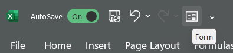

**Purpose:**

The Data Source Library is a working repository of data sources reviewed to populate the Contaminants Atlas Dataset.

<table>
<colgroup>
<col style="width: 17%" />
<col style="width: 51%" />
<col style="width: 31%" />
</colgroup>
<thead>
<tr>
<th style="text-align: left;"><strong>Step</strong> </th>
<th style="text-align: left;"><strong>Major Activity</strong> </th>
<th style="text-align: left;"><strong>References, Forms and Details</strong> </th>
</tr>
</thead>
<tbody>
<tr>
<td style="text-align: center;">1 </td>
<td><ol type="1">
<li>
Open the most current version of the Contaminants Atlas Database in Excel
</li>
<li>
Open the “DSL” worksheet
</li>
</ol></td>
<td></td>
</tr>
<tr>
<td style="text-align: center;">2 </td>
<td><ol type="1">
<li>
Navigate to the Quick Access Toolbar on the top-left and click the “Form” button.

<ol type="a">
<li>
This will prompt a data form where you can add, edit, find, delete rows of table data. By default, the first record in the table will be displayed.
</li>
</ol></li>
</ol></td>
<td style="text-align: center;">

<ul>
<li>
If you do not see this option, follow <a href="https://support.microsoft.com/en-us/office/add-edit-find-and-delete-rows-by-using-a-data-form-17bca0a4-3ba5-444a-983c-a8ce70609374?ns=excel&amp;version=90&amp;syslcid=1033&amp;uilcid=1033&amp;appver=zxl900&amp;helpid=20993&amp;ui=en-us&amp;rs=en-us&amp;ad=us#:~:text=Add%20the%20Form%20button%20to%20the%20ribbon">these instructions</a> on how to add the Form button to your Quick Access Tool Bar.
</li>
</ul>

While using the Form is not required, it is <em>highly recommended</em> as it reduces the need to scroll horizontally when entering data.
</td>
</tr>
<tr>
<td style="text-align: center;">3 </td>
<td><ol type="1">
<li>
Select “New” to add a new row of data to the table.
</li>
</ol></td>
<td>
On the right side of the window, there is a list of buttons with various operations. (New, Delete, Restore, etc.)

For more information on how to perform other operations on the table data using the Form, <a href="https://support.microsoft.com/en-us/office/add-edit-find-and-delete-rows-by-using-a-data-form-17bca0a4-3ba5-444a-983c-a8ce70609374?ns=excel&amp;version=90&amp;syslcid=1033&amp;uilcid=1033&amp;appver=zxl900&amp;helpid=20993&amp;ui=en-us&amp;rs=en-us&amp;ad=us#:~:text=the%20blank%20column.-,Use%20a%20data%20form,-You%20can%20use">see here</a>
</td>
</tr>
<tr>
<td style="text-align: center;">4</td>
<td><ol type="1">
<li>
Enter the data for the displayed fields as defined in the <strong>Data Dictionary</strong>, with the exception of the following

<ol type="a">
<li>
SourceID
</li>
<li>
Local file name*
</li>
</ol></li>
</ol></td>
<td>
Try to fill out as many of the data fields as possible, given the availability of the information.

*Local file name will be autogenerated once the rest of the fields are completed.
</td>
</tr>
<tr>
<td style="text-align: center;">5</td>
<td><ol type="1">
<li>
Generate a source ID using this python script (<a href="https://pacificsalmonfoundation-my.sharepoint.com/:u:/g/personal/psalinasruiz_psf_ca/EY9awYeiNaBKrV3yvbsopmEBORq2HO6gz1joKDH3IFFguA?e=L5AJpg">140-F10</a>)
</li>
<li>
Copy and paste it into the sourceID field in the data form
</li>
</ol></td>
<td></td>
</tr>
<tr>
<td style="text-align: center;">6</td>
<td><ol type="1">
<li>
Once all available data has been entered, click “Close”
</li>
</ol></td>
<td>A new row should be generated in the table with the information that was entered.</td>
</tr>
<tr>
<td style="text-align: center;"></td>
<td><ol type="1">
<li>
Download the source document as a PDF to the <a href="https://pacificsalmonfoundation-my.sharepoint.com/:f:/g/personal/psalinasruiz_psf_ca/ElF7_n_oyyBPqBIMqNY2mjEBW6qcdH6EjFVuspqgq_faTg?e=py8Yv7">Sources</a> folder under our shared Contaminant_Atlas folder
</li>
<li>
Rename the file according to the auto-generated file name in the table*
</li>
<li>
Save the file
</li>
</ol></td>
<td>*The way the local file name is currently generated, it does not omit invalid characters. -i.e. if the source title has a colon ( : ) . When this occurs, just delete the invalid character.</td>
</tr>
</tbody>
</table>
