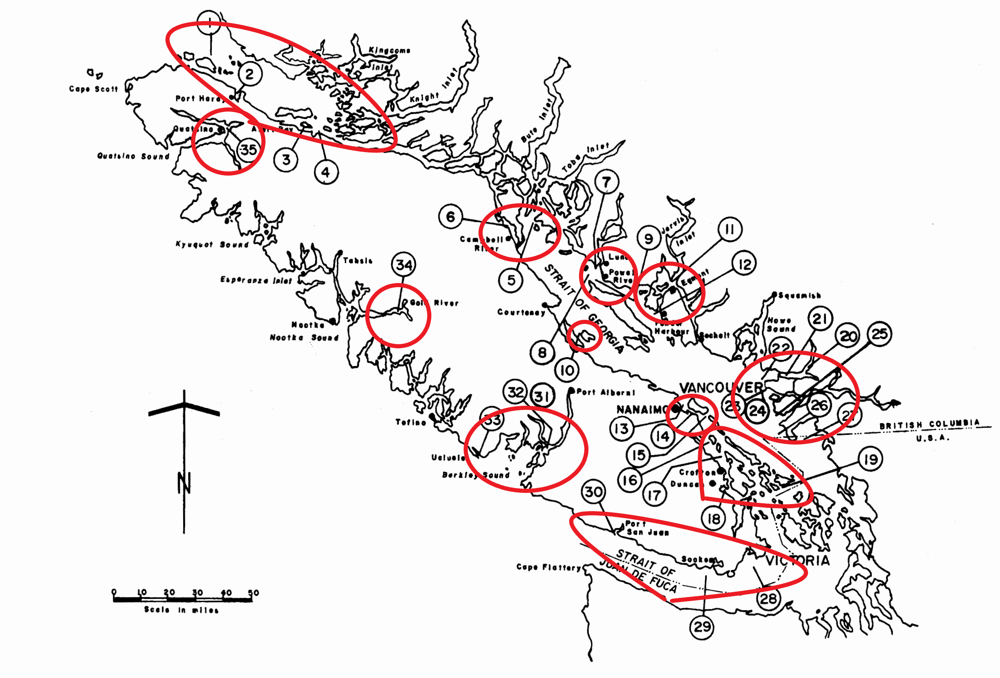

**There is also a description of each column for the Contaminant Atlas in the Excel sheet under Data Dictionary**

**Purpose:**

The Event Core is the spatiotemporal metadata repository of each site within each report.

<table>
<colgroup>
<col style="width: 10%" />
<col style="width: 47%" />
<col style="width: 42%" />
</colgroup>
<thead>
<tr>
<th style="text-align: center;"><strong>Step</strong> </th>
<th style="text-align: center;"><blockquote>

<strong>Major Activity</strong> 

</blockquote></th>
<th style="text-align: center;"><blockquote>

<strong>References, Forms and Details</strong> 

</blockquote></th>
</tr>
</thead>
<tbody>
<tr>
<td style="text-align: center;">1 </td>
<td><ol type="1">
<li>
Navigate to our shared folder: <a href="https://pacificsalmonfoundation-my.sharepoint.com/:f:/g/personal/psalinasruiz_psf_ca/EtpmRc-zswRJnghvEG1cCB4BIg9CpKGSNxQLfWkr7maYPQ?e=ec04e2">140_ContaminantsAtlas</a>
</li>
<li>
Select the “Data” Folder
</li>
<li>
Open the most recent “ContaminantAtlas_Database_yymmdd”
</li>
</ol></td>
<td><ul>
<li>
It is important that the dataset gets updated every 2 weeks. To do so, save the new version with the current date, and move the old version to the “Archived” folder.
</li>
</ul></td>
</tr>
<tr>
<td style="text-align: center;">2 </td>
<td><blockquote>

Create and enter fid

</blockquote></td>
<td><ul>
<li>
“fid” is a unique identifier for each entry made in all 3 Cores. Each event has a unique fid. To assign, simply add 1 to the greatest fid available.
</li>
</ul></td>
</tr>
<tr>
<td style="text-align: center;">3</td>
<td>Organizing/grouping sampling sites into Event entries</td>
<td><ul>
<li>
For areas with multiple sample sites close together, pick one site to represent the general area for the Event. (Example down below)
</li>
<li>
Use this site for verbatimSite and lat/lon
</li>
<li>
This is to reduce redundant info in the EventCore
</li>
<li>
Make sure different years of sampling are represented in the Event
</li>
<li>
(e.g. site A sampled in 2001 &amp; 2002,
</li>
</ul>

site B sampled in 2001,

Event for site A and B in 2001,

separate Event for site B in 2002)

[Some previous report entries will have one Event per site, so not all Event entries will follow this format]
</td>
</tr>
<tr>
<td style="text-align: center;">4</td>
<td>Create eventID</td>
<td><ul>
<li>
The event ID is a unique identifier for each event. Ideally, there will not be any repeated values in this column of the spreadsheet.
</li>
<li>
To create it, we use the following formula: =[@dateIdentified]&amp;"_"&amp;
</li>
<li>
[@decimalLatitude]&amp;"_"&amp;
</li>
<li>
[@decimalLongitude]&amp;"_"&amp;
</li>
<li>
[@sourceID]
</li>
</ul></td>
</tr>
<tr>
<td style="text-align: center;">5</td>
<td>Enter the sourceID generated for the report in the DSL (<a href="https://pacificsalmonfoundation-my.sharepoint.com/:w:/g/personal/psalinasruiz_psf_ca/EeCv1Pt1mgdFkb_ctEgQYxwBxSlwe2gwrEfmuH-K8LKWiw?e=HqhA7C">140-01</a>)</td>
<td><ul>
<li></li>
</ul></td>
</tr>
<tr>
<td style="text-align: center;">6</td>
<td>Enter dateIdentified</td>
<td><ul>
<li>
Year in which the sampling was conducted.
</li>
<li>
If the sampling spanned over years and did not specify which samples came from which year, enter the range of years (e.g. 2003-2005)
</li>
</ul></td>
</tr>
<tr>
<td style="text-align: center;">7</td>
<td>Enter monitoringProgram</td>
<td><ul>
<li>
This will be listed in the report
</li>
<li>
Also, can reference the sheet, Program Information
</li>
<li>
Leave blank if nothing is listed
</li>
</ul></td>
</tr>
<tr>
<td style="text-align: center;">8</td>
<td>Determine locality</td>
<td><ul>
<li>
Locality is defined as the specific description of the place in the reports. In our case, we define it as the closest city to the “verbatim_locality”
</li>
</ul></td>
</tr>
<tr>
<td style="text-align: center;">9</td>
<td>Determine higherGeography_watershed</td>
<td><ul>
<li>
Water body/watershed where sample was taken.
</li>
</ul></td>
</tr>
<tr>
<td style="text-align: center;">10</td>
<td>Enter verbatimLocality</td>
<td><ul>
<li>
Verbatim locality is the original textual description of the place as mentioned in the report.
</li>
</ul></td>
</tr>
<tr>
<td style="text-align: center;">11</td>
<td>Enter verbatimSite</td>
<td><ul>
<li>
Verbatim site is the specific site at which the sample(s) was taken.
</li>
<li>
If you grouped together multiple sites for one entry, choose one site to enter here
</li>
</ul></td>
</tr>
<tr>
<td style="text-align: center;">12</td>
<td>sitesIncluded</td>
<td><ul>
<li>
If you grouped multiple sites together into one Event, listed all sites here.
</li>
<li>
If you only have one site for an Event, put .
</li>
</ul></td>
</tr>
<tr>
<td style="text-align: center;">13</td>
<td>Determine decimalLatitude and decimalLongitude</td>
<td><ul>
<li>
Make sure the unit are decimal degrees (meters). If the report does not mention lat and long for their stations, use our georeferencing process (<a href="https://pacificsalmonfoundation-my.sharepoint.com/:w:/g/personal/psalinasruiz_psf_ca/EWKY4fJlxBFGntU-Yq9obPEBfO2LY4a_CHAiMbnnkNFdpg?e=Sb2Tbj">130-33</a>) to get a close approximation.
</li>
</ul></td>
</tr>
<tr>
<td style="text-align: center;">14</td>
<td>Enter samplingGroup</td>
<td><ul>
<li>
This is the organization that conducted the sampling and created the report.
</li>
<li>
Enter NA if it is not listed
</li>
</ul></td>
</tr>
<tr>
<td style="text-align: center;">15</td>
<td>Enter eventType</td>
<td><ul>
<li>
This is the description of the program through which the sampling was conducted.
</li>
<li>
Copy the title of the report and remove any non-relevant info (report no., etc.)
</li>
</ul></td>
</tr>
</tbody>
</table>

Example on how to divide sampling sites into general areas, each red circle would be its own fid in the Event.

Then in the OccurenceCores, for example, sites 1, 2, 3 and 4 will share the same fid (in the beginning of their unique fid – see Adding Records to the OccurenceCore for fid info.) as they were grouped together.

**Adding to the Event Core for reports that have already been seen:**

(POV: you were just in the detection core and noticed there’s different sets of coordinates associated with the same fid (which should be unique per site!) OR you realized not all the sites sampled in the report/publication were recorded in the detection core)

STEPS TO FIX:

- Replace the repeating fids (in the Detection Core) with new fids for the new coordinates

- In the Event Core, find the fid for that site listed in the Detection Core, then insert as many rows as new fids you created

- Enter the new fids into the empty rows (fids should never be repeated in the Event Core)

- Copy paste the source ID (should be the same for every entry in the EC for that report)

- Fill in the rest of the columns

  - If all sites are in the DC (scenario 1 above) you can simply go there and for each site copy paste the coordinates into the EC

  - If the coordinates have not been entered as sites are missing (i.e. the second scenario above), then do georeferencing to extract the locations!
