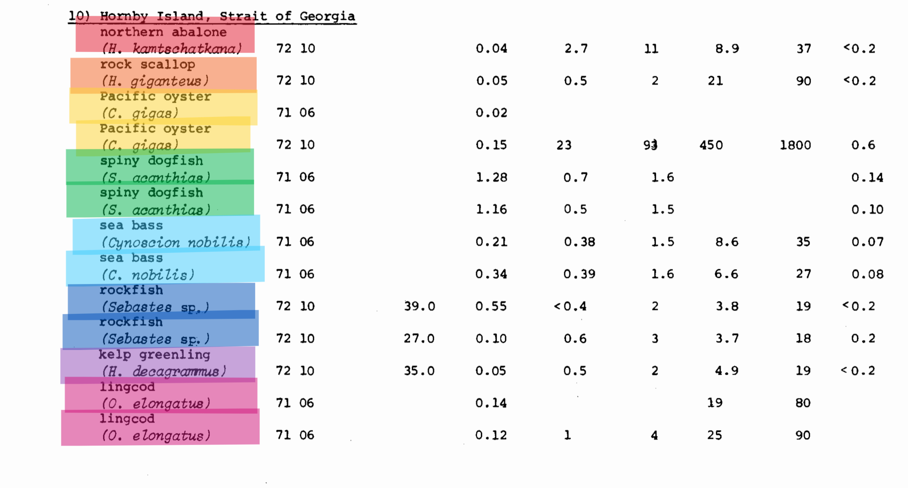
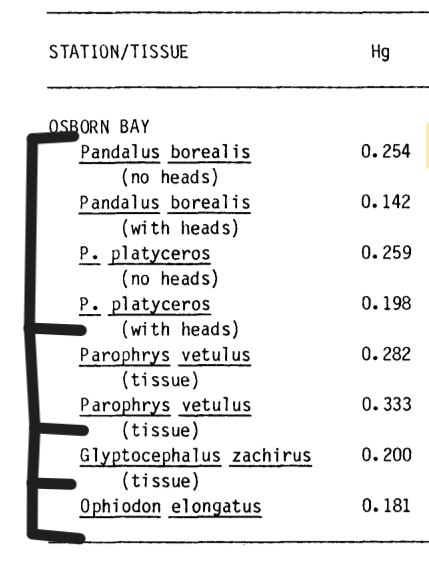
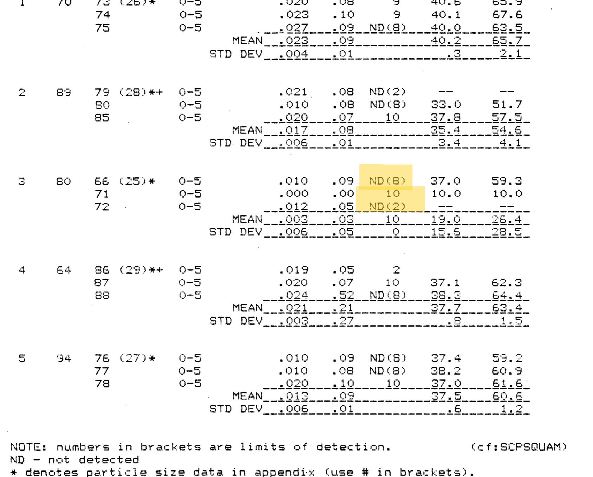
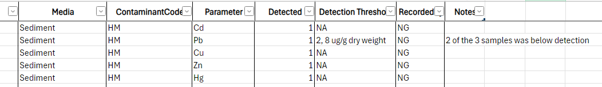

**There is also a description of each column for the Contaminant Atlas in the Excel sheet under Data Dictionary**

**Purpose:**

The Occurrence Core contains the data extracted from the reports. There is usually a one-to-many relationship between the Event Core and the Occurrence Core where the Occurrence Core has more records than the Event Core.

<table>
<colgroup>
<col style="width: 10%" />
<col style="width: 48%" />
<col style="width: 40%" />
</colgroup>
<thead>
<tr>
<th style="text-align: center;"><strong>Step</strong> </th>
<th style="text-align: center;"><blockquote>

<strong>Major Activity</strong> 

</blockquote></th>
<th style="text-align: center;"><blockquote>

<strong>References, Forms and Details</strong> 

</blockquote></th>
</tr>
</thead>
<tbody>
<tr>
<td style="text-align: center;">1 </td>
<td><ol type="1">
<li>
Navigate to our shared folder: <a href="https://pacificsalmonfoundation-my.sharepoint.com/:f:/g/personal/psalinasruiz_psf_ca/EtpmRc-zswRJnghvEG1cCB4BIg9CpKGSNxQLfWkr7maYPQ?e=ec04e2">140_ContaminantsAtlas</a>
</li>
<li>
Select the “Data” Folder
</li>
<li>
Open the most recent “ContaminantAtlas_Database_yymmdd”
</li>
</ol></td>
<td><ul>
<li>
It is important that the dataset gets updated every 2 weeks. To do so, save the new version with the current date, and move the old version to the “Archived” folder.
</li>
</ul></td>
</tr>
<tr>
<td style="text-align: center;"></td>
<td></td>
<td><ul>
<li>
Each site will have its own Occurrence entry, unlike in EventCore
</li>
</ul></td>
</tr>
<tr>
<td style="text-align: center;">2 </td>
<td><blockquote>

Enter fid

</blockquote></td>
<td><ul>
<li>
“fid” is a unique identifier for each entry made in all 3 Cores. Enter the fid assigned to the sampling site in the Event Core.
</li>
<li>
For OccurenceCore_Presence, add _# to each fid so all fids are unique
</li>
<li>
For OccurenceCore_Detection, add another _# to each fid
</li>
<li>
<strong>E.g.</strong> Event fid = 1234
</li>
</ul>

Presence fid = 1234_3

Detection fid = 1234_3_1
</td>
</tr>
<tr>
<td style="text-align: center;">3 </td>
<td>Enter eventID associated with that site</td>
<td><ul>
<li>
Copy from Event Core
</li>
</ul></td>
</tr>
<tr>
<td style="text-align: center;">4</td>
<td>Create occurenceID</td>
<td><ul>
<li>
OccurenceCore_Presence and OccurenceCore_Detection have different IDs
</li>
<li>
There will not be any repeated values in these column (some exceptions)
</li>
<li>
Formula is already set up
</li>
</ul></td>
</tr>
<tr>
<td style="text-align: center;">5</td>
<td>Enter verbatimLocality</td>
<td><ul>
<li>
Verbatim locality is the original textual description of the place as mentioned in the report.
</li>
</ul></td>
</tr>
<tr>
<td style="text-align: center;"></td>
<td>Enter verbatimSite</td>
<td><ul>
<li>
Verbatim site is the specific site at which the sample(s) was taken.
</li>
</ul>

(Make sure ALL sites are included
</td>
</tr>
<tr>
<td style="text-align: center;">6</td>
<td>Enter dateIdentified</td>
<td><ul>
<li>
Sampling year
</li>
</ul></td>
</tr>
<tr>
<td style="text-align: center;">7</td>
<td>Enter year</td>
<td><ul>
<li>
Same as date identified, but with specific formatting for “date” to read in ArcGIS
</li>
<li>
Formula is already set up
</li>
</ul></td>
</tr>
<tr>
<td style="text-align: center;">8</td>
<td>Enter latitude and longitude</td>
<td><ul>
<li>
Make sure the unit are decimal degrees (meters). If the report does not mention lat and long for their stations, use our georeferencing process (<a href="https://pacificsalmonfoundation-my.sharepoint.com/:w:/g/personal/psalinasruiz_psf_ca/EWKY4fJlxBFGntU-Yq9obPEBfO2LY4a_CHAiMbnnkNFdpg?e=Sb2Tbj">130-33</a>) to get a close approximation.
</li>
</ul></td>
</tr>
<tr>
<td style="text-align: center;">9</td>
<td>
Enter measurementMethod

(Detection only)
</td>
<td><ul>
<li>
This is the methodology used by the lab to process the samples.
</li>
<li>
Look specifically for the analyzing method
</li>
<li>
Enter NA if not listed
</li>
</ul></td>
</tr>
<tr>
<td style="text-align: center;">10</td>
<td>
Enter Analyzing Lab

(Detection only)
</td>
<td><ul>
<li>
Enter NA if not listed
</li>
</ul></td>
</tr>
<tr>
<td style="text-align: center;">11</td>
<td>Enter Media</td>
<td><ul>
<li>
Material or tissue through which the contaminant was measured
</li>
</ul></td>
</tr>
<tr>
<td style="text-align: center;">12</td>
<td>Enter ContaminantCode</td>
<td><ul>
<li>
Find in validation
</li>
</ul></td>
</tr>
<tr>
<td style="text-align: center;"></td>
<td>
Enter Parameter

(Detection only)
</td>
<td><ul>
<li>
Find in validation
</li>
</ul></td>
</tr>
<tr>
<td style="text-align: center;">13</td>
<td>
Enter Sampled

(Presence only)
</td>
<td><ul>
<li>
Whether contaminant was sampled or not. 0 means no and 1 means yes.
</li>
</ul></td>
</tr>
<tr>
<td style="text-align: center;">14</td>
<td>
Enter Detected

(Detection only)
</td>
<td><ul>
<li>
Whether contaminant was detected or not. 0 means no and 1 means yes.
</li>
</ul></td>
</tr>
<tr>
<td style="text-align: center;">15</td>
<td>
Enter Detection threshold

(Detection only)
</td>
<td><ul>
<li>
As reported
</li>
<li>
When you are not sure if you have the correct number for the detection threshold, report 1 for Detected and add into Notes what was it could be
</li>
</ul>

(many times it will be reported as &lt;###, but not say if that means it is under the detection)
</td>
</tr>
<tr>
<td style="text-align: center;">16</td>
<td>Recorded</td>
<td><ul>
<li>
Add initials of the person who entered the data
</li>
</ul></td>
</tr>
<tr>
<td style="text-align: center;">17</td>
<td>Notes</td>
<td><ul>
<li>
Include information like if there are multiple species of the same organism in that entry See below for example <strong>- Presence</strong>
</li>
<li>
And if 1 or more of the samples are below the detection threshold (if one or more is above, detected is still = 1) See below for example <strong>- Detection</strong>
</li>
</ul></td>
</tr>
</tbody>
</table>

Example on how to group organisms within the same sampling site. If there was different species withing the same genus, group them together and make a note that there are multiple species in that sample. (Make sure you do not combine different sampling years)

Example on how to report detection thresholds for a sample that had multiple thresholds. Since 1 of the 3 was detected (10), report his as detected. In the notes, include that 2 of the 3 samples were not detected and include both 8 and 2 in the detection threshold column.

