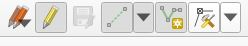

# Digitizing Shoreline Modifications with Boat-based Imagery, QGIS, Open Street Maps (Mapillary), and Google Earth Pro

**Objective**: To digitize shoreline modifications along the entire east coast of Vancouver Island using linear features.

**Summary**

In 2023, the Resilient Coasts for Salmon team began digitizing shoreline modifications along the east coast of Vancouver Island with high resolution boat-based imagery, Open Street Maps, QGIS, Google Earth Pro and ground surveys in some regions. The resulting linear feature dataset describes the extent of modifications found as of 2022 (Regions 1 and 2), 2023 (Region 3), and 2024 (Region 4) (see Table 4 Data Dictionary). Percentages will be calculated for the extent of shoreline modification in specific areas. These data can be used to better understand and manage Vancouver Island’s shorelines and coastal ecosystems. These data will be available on the [Marine Reference Guide](https://sogdatacentre.ca/sogmrg/) (Strait of Georgia Data Centre), and several community reports will be available at resilientcoasts.ca. The following is a detailed document of the processes that were followed to digitize the data. 

**Consistency**

Digitization methodologies have been developed collaboratively by two recorders, who observed and digitized features (shoreline modifications) for the Resilient Coasts for Salmon project, to ensure that observations and digitization are congruent. The digitization methodology (also referred to as protocols) were developed through practice attempts, comparisons, discussions, and multi-day collaborative in-person decision-making. Typically, the digitization process of observing and recording features by imagery utilizes between 1 – 3 sources to confirm the presence of a feature. It is typical that all of the following sources are utilized when digitizing a feature: QGIS, Mapillary/Open Street Maps, and Google Earth Pro. Drone imagery supplemented some areas where boat imagery could not be taken. In some cases, sites were visited in person to ground-truth features that were obscured, while some involved utilizing aerial imagery from Google Map/Earth data when visits were not feasible. In cases where a large length of shoreline is not accessible, not feasible to visit, and not visible by any imagery, the length of shoreline was recorded and have been omitted from the analyses.

**Data Dictionary**

A data dictionary was created. See Table 4.

**Confidence**

Confidence is rated as low, moderate or high for each shoreline modification feature (see Table 3).

There is a high likelihood that a greater amount of shoreline modifications exists than what is currently digitized in the dataset; many elements in the landscape can obscure views, including dense vegetation. Additionally, many features were observed that will interact with natural coastal processes as sea level rises but were not included in the dataset as they do not currently interact with coastal processes.

Accuracy

At times, the exact measurement of a feature may not be certain, therefore the accuracy of the length in the digitized features may vary from its true length by up to 3 meters.

The exact location of secondary features (Form_2), such as beach access or a groyne, are not defined if it exists within a larger modified shore segment (e.g., seawall).

**Notes:**

Length of line feature does not correspond to the amount of impact it may have on natural coastal processes.

Obtaining toe-elevations for each structure would be valuable data but was not feasible to collect at this scale.

Reserve areas have not been digitized.

These protocols have been developed for the project’s objective of mapping shoreline conditions at a discreet point in time. Additional rules were created for digitizing features within estuaries (Table 2) but creating a fulsome dataset would require multiple sampling events and different protocols. We recommend creating distinct protocols to digitize modifications within estuaries (e.g., estuarine marsh and meadows, mudflats, etc.) and tracking estuaries through time. Imagery of estuaries were often taken from drone, tender, or by foot due to the difficulty of larger vessels accessing the estuaries. 

Digitization of beach access and boat ramp features do not distinguish between private or public access, nor is it exhaustive. Please respect private property and visit local websites to find public beach access points.

Digitization is a term used synonymously with classify.

There are features that interrupt natural coastal processes that are not contained in this dataset: features that do not intersect with the shoreline or sit in the intertidal zone, are below ground, or exist offshore. Features are digitized when there is a visible above-ground structure on the shoreline (see Figure 1).

<figure>

<figcaption>
Figure 1 Example of structure that would impact coastal processes but would not be included in the dataset.
</figcaption>
</figure>

Structures can be classified as seawalls/bulkheads (attributes) when they act as barriers to natural coastal processes even though they were not necessarily constructed for that purpose. Often, these are walls created to delineate property lines but still function in ways that impact natural coastal processes.

<table>
<colgroup>
<col style="width: 5%" />
<col style="width: 18%" />
<col style="width: 43%" />
<col style="width: 32%" />
</colgroup>
<thead>
<tr>
<th></th>
<th></th>
<th colspan="2"><strong>Table 1. Digitizing Modified Shoreline Features from Imagery</strong></th>
</tr>
</thead>
<tbody>
<tr>
<td><strong>Step</strong></td>
<td><strong>Major Activity</strong></td>
<td><strong>Protocols, Rules and Additional Details</strong></td>
<td></td>
</tr>
<tr>
<td>1</td>
<td>Create a layer for shoreline modifications (line feature) in QGIS</td>
<td colspan="2">
Follow steps in Process # <a href="https://www.dropbox.com/scl/fi/k99n2aaiyqedjguah2h2o/400-02-Performing-Digitization-in-QGIS.docx?dl=0&amp;rlkey=hc803bl3x6fkdhrpf0uy9qha1">400-02</a> (Ben Skinner), <em>Performing Digitization in QGIS</em>. See Appendix 1. Follow steps until step 5 is completed.

If you are inputting the field attributes and need to adjust the sequence of fields, follow <a href="https://gis.stackexchange.com/questions/240258/changing-fields-order-in-qgis#:~:text=Right%2Dclick%20the%20column%20headings,Click%20OK%20.">these instructions</a>.
</td>
</tr>
<tr>
<td>2</td>
<td>Saving files and distinguishing ID numbers</td>
<td colspan="2">
Save file with your initials. If more than one person is entering data separately, ensure that the id (sequence of #’s attached to each line feature) do not overlap.

In the Attributes Form, under Layer Properties, enter the following to begin counting at 100,000:

‘IF (maximum("id") is NULL, 100000, maximum("id") + 1)’
</td>
</tr>
<tr>
<td>3</td>
<td>Open file</td>
<td colspan="2">
Open QGIS, select the project file located on the left side of the screen.

Download and select the ESRI basemap package in QGIS if it is not present.
</td>
</tr>
<tr>
<td>4</td>
<td>Check that fields are pre-entered for each attribute</td>
<td colspan="2">
If the fields are not already pre-entered, add these attributes with the steps provided <a href="https://www.dropbox.com/scl/fi/k99n2aaiyqedjguah2h2o/400-02-Performing-Digitization-in-QGIS.docx?dl=0&amp;rlkey=hc803bl3x6fkdhrpf0uy9qha1">here</a>.

<u>ID</u>

<u>Type:</u> Anthropogenic modified, Anthropogenic modified on rocky outcrop

<u>Form 1/Form 2</u>: seawall/bulkhead, riprap, beach access (path/stairs), boat ramp, groyne, dock, stormwater outfall, jetty/pier/breakwater, marina, gabion basket, ferry terminal, fill (sand, soil, or other material added), logging infrastructure, aquaculture infrastructure, other (comment)

<u>Material</u>: concrete, rock, wood, creosote wood, masonry, metal, undefined (add comment)

<u>Confidence</u>: high, moderate, low

<u>Grdtruthed</u>: yes, no

<u>Comments</u>

<u>Date</u>

<u>Recorder</u>
</td>
</tr>
<tr>
<td>5</td>
<td>Open boat-based mapping data in OpenStreetMap (OSM) </td>
<td>
Open Mapillary in your web browser, select the icon with three dots located on the right-hand side of the screen.

Select iD under “Edit OpenStreetMap with this image<strong>”</strong> to open boat-based mapping data in OpenStreetMap (OSM) (Figure 2). 
</td>
<td style="text-align: center;">

Figure 2 How to open OSM.
</td>
</tr>
<tr>
<td>6</td>
<td>View imagery</td>
<td>
Use multiple screens if possible. Find the location of interest that you want to digitize. Zoom in to full extent with the imagery pop-out box.

There are two track lines, one is a 360-degree view and another is higher resolution imagery (the blue line in this image) (Figure 3). This hi-res imagery is the clearest option to use. Switch between images using the arrows (Figure 4).

Zooming in can help ascertain whether a feature is present or to help decipher extent/boundaries, especially in areas where vegetation is dense.
</td>
<td>

Figure 3 Two track lines to view imagery.

Figure 4 You can adjust the speed, pause and switch between the series of photos.
</td>
</tr>
<tr>
<td>7</td>
<td>Reviewing multiple sources</td>
<td>
After reviewing the boat-based imagery in OSM, it is often helpful and necessary to compare imagery across multiple platforms to increase confidence (Figures 5,6,7). Review QGIS ESRI Satellite basemap, aerial satellite imagery using Google Earth, and ground-view imagery within google map data. Google Earth allows you to view the shoreline from a variety of angles and years (<em>Year</em> button can be found on the bottom left corner).

Use the most recent imagery with optimal resolution.

Ground truthing is encouraged for cases where an area is not accessible by boat or is not visible by boat-based imagery or drone. In cases when ground truthing is not feasible, recent aerial imagery, ground-view google photos and street-view can be used. Include a note in the comments when only aerial imagery was used as this may reduce confidence. The aim is to utilize year 2022 onwards to digitize features from aerial imagery, to be aligned with boat-based imagery. If imagery from years prior to 2022 are used, please indicate this in the comments.

If an area is fully obstructed from all aforementioned means, calculate the length of shoreline and remove it from any regional analyses. Keep track of these specific areas.
</td>
<td style="text-align: center;">

Figure 5 QGIS with ESRI Satellite basemap does not clearly show a wall

Figure 6 OSM and QGIS may not have clear imagery (there are indications of a wall but it is not 100% clear).

Figure 7 Google Earth Pro shows a clear outline of the wall.
</td>
</tr>
<tr>
<td>8</td>
<td>Find features along the shoreline that are anthropogenically constructed</td>
<td>
Modifications are digitized when &gt; or = 2m in length. If it is difficult to gauge length visually, create a temporary line feature along the object to ascertain (right-click to see Length under “ID” - “derived”). 

Features are only digitized when there is a visible above-ground structure on the shoreline (at the upland/shoreline interface within the intertidal zone) – features that exist that do not intersect with the shoreline or exist in the intertidal zone, are below ground, or exist offshore were not included in the dataset.

Structures can be classified as seawalls/bulkheads when they act as barriers to natural coastal processes. Often, there are walls created to delineate property lines but still function in ways that impact natural coastal processes.

When a structure, like a groyne or pier, runs perpendicular to the shoreline, digitize the part that runs parallel to the shore only (Figure 8).

Figures 9 – 11 shows how structures built in the intertidal can function like groynes but do not fully intersect with the shoreline. These can be entered as groynes or “other” and details can be added to the comment section.

Pilings are not considered a modification unless there are several lined up to perform a function, such as to prevent drift logs from moving landward, or when situated side-by-side to form a retaining wall (Figure 12). Methods differ for digitizing pilings within estuaries (see <em>How to digitize features within an estuary</em> below). For instances when there is an individual piling, refer to document: <em>Docks and Log Accumulation Protocol</em>.

Anthropogenic fill is not always obvious (e.g., extra land created for logging infrastructure). The <a href="https://www.shorezone.org/">ShoreZone</a> “human-made” shore type layer can be used to determine where fill or other modifications are. However, this layer can be used post digitization (Figure 13).
</td>
<td style="text-align: center;">

Figure 8 How to digitize a groyne.

Figure 9 Structures that function as groynes but do not intersect with the upland.

Figure 10 Structures that function as groynes but do not intersect with the upland.

Figure 11 Structures that function as groynes but do not intersect with the upland.

Figure 12 An example of a retaining wall/bulkhead made with logs.

Figure 13 The grey line shows human-made shore type (ShoreZone).
</td>
</tr>
<tr>
<td>9</td>
<td>Select “toggle editing” mode to start the digitization process</td>
<td>The yellow pencil icon is for toggle editing mode (Figure 14).</td>
<td style="text-align: center;">

Figure 14 Toggle editing mode selected (Yellow pencil icon).
</td>
</tr>
<tr>
<td>10</td>
<td>Add a line feature</td>
<td>
Select “Add Line Feature” in QGIS (Figure 15).

Only modifications that have the ability to impact natural coastal processes, including at high “king” tides, are digitized. Upland structures on terrestrial land, such as landscaping features (Figure 16), and any structures built higher on rocky outcrop that would not impact coastal processes at the time of digitization, are not digitized/included in the dataset.

All modifications of the same type and material can be mapped in a continuous line regardless of property lines or time of construction.

Driftwood and beach wrack lines can act as indicators of high tides (Figure 17).
</td>
<td style="text-align: center;">

Figure 15 Icon for creating a line feature.

Figure 16 An example of a wall that is a landscape feature, not a shoreline modification.

Figure 17 Driftwood.
</td>
</tr>
<tr>
<td>11</td>
<td>Create a line feature</td>
<td>
Left click your mouse to begin a line feature, working as close to the modification as possible. Trace the contour/curvature of the shoreline using vertices as needed. Do not trace the feature unless it follows the curvature of the shoreline. Right-click to end the individual line feature.

Select the colour orange (# ff9e17) for the line and increase the thickness to 0.9mm. Set these styles as the default (Figure 18).

You can switch between the Pan Map mode (Figure 19) and Edit mode as you create a line feature. The line feature will continue to be made until you right-click your mouse to complete it.

Line features should <strong>not</strong> overlap one another.

Use indicators like stormwater outfall infrastructure, roads and large trees to situate yourself as you digitize. For example, there are visible structures in both GIS satellite aerial view and OSM (Figure 20).

Smaller islands that are connected to the main island, such as by a road, should be included in the digitization (Figure 21).

When digitizing a marina, add a line along the shoreline parallel to where the marina is built, including where the shoreline has been modified to support or protect the marina (Figure 22).

Create a new line feature when the following occurs:

<ol type="1">
<li>
The modification/feature ends and the shore is natural (not modified).
</li>
<li>
There is a change in the form of the modification (from seawall to riprap). However, any feature that sits within another larger feature, that is equal or less than 2 meters, can be classified as Form_2. (See Step 12).
</li>
<li>
There is a change in the material of the modification (concrete to wood).
</li>
<li>
There is a change in your level of certainty (confidence).
</li>
</ol></td>
<td style="text-align: center;">

Figure 18 Selecting the style for your line feature.

Figure 19 Pan Map icon.

Figure 20 Examples of stormwater indicators.

Figure 21 Example of small island attached by a road to Vancouver Island.

Figure 22 An example of how to digitize a marina.
</td>
</tr>
<tr>
<td>12</td>
<td>
Fill in field attributes

See <strong>Table 4.</strong> <strong>Data Dictionary</strong> for more attribute details.
</td>
<td>
<u>iD</u> is automatically generated

<u>Type</u> refers to the shoreline substrate that a modification sits on. <em>Anthropogenic modified on rocky outcrop</em> refers to a feature located on a rocky outcrop or rocky platform (built on top of or embedded within rock) (Figure 23). <em>Anthropogenic modified</em> refers to a feature located on a shoreline that is sandy, pebbly, or cobble substrate, not otherwise rocky outcrop/platform (Figure 24).

<u>Form 1 and Form 2</u> describe the line feature being entered. Form_1 is the primary feature type that is associated with a modification. It is often not necessary to enter Form_2 but it adds detail such as describing a secondary feature that sits within a larger feature. E.g., stairs to the beach exist in a seawall –&gt; Form_1= seawall, Form_2= beach access (Figure 24). In this case, Form_1 is the main structure with longer length and Form_2 is the shorter length structure that sits within it.

<u>Material</u> – select the dominant material of the feature where it intersects with the shoreline.

<u>Confidence</u> ratings reflect recorders degree of certainty of the presence and location of a feature, assigning either Low, Moderate, or High. See Step 13.

<u>Date – the date that the feature was digitized.</u>

<u>Recorder</u> – the name of the individual digitizing.

<u>Grdtruthed</u> – indication of whether a feature was visited in person to ground truth its presence.

<u>Comments – any additional notes that the recorder feels are relevant to providing more detailed information about the feature.</u>

If there are two features that run parallel on the shoreline (Figure 25), classify the most shoreward structure (i.e., Form_1= riprap, Form_2= seawall).

In cases where the shoreward structure is sparse in materials, enter Form _1= seawall and Form_2= riprap, and add a note.

For marinas, Form_2 can be used to describe specific modifications associated with the marina, while Form_1 = marina. 

For <em>Gabion basket</em> features, do not include Form_2 or a material.

Structures can be classified as <em>seawalls/bulkheads</em> if they act as impediments to natural coastal processes. For instance, there are often walls or fences to delineate property lines, but still function in ways that impact natural coastal processes, and thus have been included in the dataset.
</td>
<td>

Figure 23 Example of Type: "Anthropogenic modified on rocky outcrop". There is a structure built on rocky outcrop.

Figure 24 A seawall (Form_1) with beach access (Form_2), located on Anthropogenic Modified (Type).

Figure 25 Riprap in front of a wall.
</td>
</tr>
<tr>
<td>13</td>
<td>
Select a confidence rating

See <strong>Table 3</strong> (below) for confidence ratings
</td>
<td colspan="2">
Uncertainty can occur when the imagery is low quality, obscured by dense vegetation, or there is difficulty with depth perception (understanding the position of feature in relation to the shoreline and upland). If you are unsure, be conservative and digitize it as low confidence (and visit the site if possible). If visited, adjust the confidence rating appropriately or delete the line if the feature did not exist.

<strong>Factors that influence certainty:</strong>

<ul>
<li>
quality of imagery
</li>
<li>
the ability to observe features from boat-based imagery and satellite imagery
</li>
<li>
whether dense vegetation obstructs view
</li>
<li>
ability to perceive depth accurately
</li>
<li>
consistent observations between reliable observers
</li>
<li>
whether the area has been visited in person (ground truthed)
</li>
</ul>

<strong>Add Brief Supporting Statements</strong>

When confidence is rated Moderate or Low it is helpful to include a brief supporting statement describing the primary reason(s) why confidence is less than High.

Anything that is considered low confidence will not be considered a feature in analyses until it is ground inspected.

<strong>Tips:</strong>

<ul>
<li>
To gauge elevation of a structure to determine whether it is a landscaping feature or not: observe vegetation surrounding and shoreward of the structure can provide indications (e.g., salt tolerant vegetation species shoreward of the structure, or if terrestrial plant species are in front of the structure).
</li>
<li>
Zoom to full extent to see colour gradient and texture variations in the imagery to help identify the presence of a feature or where one starts and stops when obscured by vegetation.
</li>
<li>
Use visual cues, such as where driftwood/logs and beach wrack lines are situated, to help indicate where the high tide was.
</li>
<li>
Toe elevation indications found in this <a href="https://resilientcoasts.ca/wp-content/uploads/2022/09/2022PSF-ShorelineMappingManual.pdf">document</a> (pg. 7) can also help determine the placement of a feature.
</li>
</ul></td>
</tr>
<tr>
<td>14</td>
<td>Editing a line feature and attributes</td>
<td>
Use the Vertex Tool to correct line features, such as deleting or adjusting portions of a line, adjusting a line’s position by dragging the vertices, or adding more length to a line by clicking the + sign that appears when you hover over the line (Figure 26).

To edit attributes associated with a line feature, select the “Identify Features” icon, then right click on the line feature (Figure 27). The feature form will pop up, click the “Edit Feature Form” button under Identify Results.

Additional editing options can be found under Edit, Edit Geometry. E.g., to move a line feature.
</td>
<td style="text-align: center;">

Figure 26 Vertex tool.

Figure 27 Identify features icon.
</td>
</tr>
<tr>
<td>15</td>
<td>Saving data</td>
<td>Save both the layer (Figure 28) and project (Figure 29) regularly to avoid losing data.</td>
<td style="text-align: center;">

Figure 28 Icon for saving the data layer.

Figure 29 Icon for saving the full file.
</td>
</tr>
</tbody>
</table>

# **How to digitize features within estuaries**

The aforementioned protocols have been developed for the project’s objective of mapping shoreline conditions at a discreet point in time. The placement of shoreline modifications have implications for coastal squeeze and estuary dynamics. In general, the dataset will follow the shoreline. However, in estuaries, the demarcation of the ‘shoreline’ can be tricky. Often, estuaries have tidal lands or islands (salt marshes). Estuarine marsh and meadows change over time; therefore it is likely that many shoreline modifications mapped in estuaries would change. For the purposes of this report, we are interested in the intersection of the upland and the beach, so the ‘shore’ will often be defined as sitting ‘behind’/landward of these marshes. Use these protocols to guide decisions on how to digitize modifications within estuaries. It is worthwhile to track estuaries through time and to meet that goal would require multiple sampling events and different protocols.

**Table 2. Protocol, rules & caveats when digitizing features within estuaries**

<table>
<colgroup>
<col style="width: 17%" />
<col style="width: 43%" />
<col style="width: 38%" />
</colgroup>
<thead>
<tr>
<th>Where to set contour line</th>
<th>
Follow the contour of the shoreline that contains terrestrial/upland vegetation, not estuarine/marsh plants (i.e., landward of the marsh) (Figures 30 and 31). Typically, these areas would have soil/sediment that is not regularly inundated with the tide. 

Roads, bridges, and berms are commonly constructed through estuaries on top of infill, creating additional terrestrial land that was not historically present. Include these areas when digitizing features. It can be helpful to use the ShoreZone “human-made” layer.

In log sorts/logging infrastructure, there are often pilings with horizontally placed logs secured parallel to the shoreline- digitize these as shoreline modifications (e.g., Form 1 = logging infrastructure) (Figure 33).

Do not digitize the pilings as line features if there are no horizontal logs secured against them/along the shoreline. See Docks and Log Accumulation Protocol that describes creating point features for pilings.
</th>
<th style="text-align: center;">

Figure 30 Example of creating a line feature for riprap that sites landward of the marsh.

Figure 31 Follow the contour of the shoreline that is landward of the marsh.

Figure 32 Berms are digitized for their entire length within estuaries.

Figure 33 Vertical pilings secured with horizontal logs.
</th>
</tr>
</thead>
<tbody>
<tr>
<td>What to do when there is infrastructure in the marsh/intertidal</td>
<td>Modifications that exist on marsh or mudflat habitat are not digitized. E.g., shellfish aquaculture (Figure 34 and 35). Only digitize modifications that connect with the shoreline (upland).</td>
<td style="text-align: center;">

Figure 34 Structures in the intertidal zone for aquaculture purposes.

Figure 35 Modifications are found in the mudflat/meadow habitat, though these modifications will not be recorded in this dataset.
</td>
</tr>
<tr>
<td>What to do when you reach streams, creeks, channels and rivers</td>
<td>
Modifications higher up in the estuary should be mapped if they fall within the waterward edge of the FAC layer (Figure 36 and 37).

Use the <a href="https://governmentofbc.maps.arcgis.com/home/item.html?id=72e9b873023b4c1da77b20d486fd4b22#visualize">Freshwater Atlas Coastlines (FAC)</a> dataset to determine how far up an estuary to digitize features. I.e., how far inland you should follow the creek, river, stream or channel that flows into an estuary. Though, keep in mind that we do not use the FAC when digitizing non-estuarine shoreline. Do not add line features for the FAC line that runs across water or crosses a channel (see Figure 36 and 37). 
</td>
<td style="text-align: center;">

Figure 36 Freshwater Atlas Coastline.

Figure 37 Digitized modifications that utilize the FAC to determine how far up an estuary to digitize features in. Note the FAC line that runs through the water is not digitized.
</td>
</tr>
</tbody>
</table>

**Table 3.** Confidence Ratings

| **Confidence Level** |  |
|----|----|
| **Low confidence** | = *High degree of* *Uncertainty. The state of deficient visual evidence for the entire stretch of shoreline, or a portion of it. These areas would be classified as low. This occurs when the understanding of the existence of a potential feature is too poor to make a solid judgement until it is visited in person to ground truth. Recorder is not confident that a feature exists, but it is possible.* |
| **Moderate confidence** | = *Lower degree of certainty/ Reduced but moderate confidence*. This may occur when the imagery is lower quality (i.e., dark/ low clarity) but when there is an elevated likelihood that a structure is present. Often, the beginning and end of a hard structure is not clearly defined but some visual indications exist in the imagery to predict with some moderate confidence that it is present. |
| **High confidence** | = *High degree of certainty/ Increased confidence*. The recorder is confident of the existence of a feature or has visual confirmation of a feature. High quality/resolution imagery provided a high level of certainty that a modification exists, either visible in boat-based and/or satellite aerial imagery or ground survey. Little or no vegetation obscures the imagery, or the vegetation does not impede the evidence of a structure behind it. There is still a chance that high confidence does not represent accurate circumstances.  |

**Table 4. Data Dictionary**

<table>
<colgroup>
<col style="width: 18%" />
<col style="width: 44%" />
<col style="width: 36%" />
</colgroup>
<thead>
<tr>
<th><strong>TERM</strong></th>
<th><strong>DEFINITION</strong></th>
<th style="text-align: center;"><strong>EXAMPLES</strong></th>
</tr>
</thead>
<tbody>
<tr>
<td>backshore</td>
<td>The zone of the shore lying above the high-water mark (indicated with a yellow arrow).</td>
<td style="text-align: center;"></td>
</tr>
<tr>
<td>basemap</td>
<td>The background map you select when in aerial view (e.g., ESRI Satellite).</td>
<td style="text-align: center;"></td>
</tr>
<tr>
<td>beach access/path</td>
<td>A pathway/ pedestrian access to the shoreline.</td>
<td style="text-align: center;"></td>
</tr>
<tr>
<td>beach wrack</td>
<td>A line of dried seaweeds, kelp, seagrasses and other debris that gets deposited at high tide.</td>
<td style="text-align: center;"></td>
</tr>
<tr>
<td>boat ramp</td>
<td>Ramps for boats, kayaks and other vessels to access the ocean; usually made of poured concrete.</td>
<td style="text-align: center;"></td>
</tr>
<tr>
<td>breakwater</td>
<td>A barrier that provides an area of reduced wave energy, commonly for harbors and marinas (ShoreZone definition). Can be oriented perpendicular or parallel to the shore.</td>
<td style="text-align: center;"></td>
</tr>
<tr>
<td>concrete</td>
<td>A digitization attribute to indicate the material the shoreline modification is made from (e.g., seawall made of concrete). </td>
<td style="text-align: center;"></td>
</tr>
<tr>
<td>confidence</td>
<td>Confidence ratings are assigned to indicate the degree of certainty of shoreline features entered in QGIS. Line Features for shoreline modifications will have a confidence rating of either Low, Moderate or High within the field attributes.</td>
<td style="text-align: center;">See Table 3 for details.</td>
</tr>
<tr>
<td>digitization</td>
<td>
The process of converting imagery (from boat-based, drone, satellite aerial imagery, or ground truthed visual inspections) into vector data (line and point features) in QGIS.

The term <em>classify</em> is often used synonymously. 

An example of the recorder’s Mapillary screen during digitizing (right), that will be converted into line features.
</td>
<td style="text-align: center;"></td>
</tr>
<tr>
<td>feature</td>
<td>
An object of interest, in this case a structure built on the shoreline.

The terms <em>object</em>, <em>hard structure</em> and <em>modification</em> are often used interchangeably. 
</td>
<td style="text-align: center;"></td>
</tr>
<tr>
<td>foreshore</td>
<td>The zone from the low water mark to the high-water mark (indicated with a red arrow).</td>
<td style="text-align: center;"></td>
</tr>
<tr>
<td>form</td>
<td>
The specific feature on the shoreline. E.g., seawall, riprap, groyne, etc.

There is Form_1 and Form_2. See protocol for distinctions. 

E.g., In the photo to the right, Form_1 would be seawall, and Form_2 would be outfall.
</td>
<td style="text-align: center;"></td>
</tr>
<tr>
<td>gabion basket</td>
<td>A digitization attribute to indicate the material the shoreline modification is made from. A type of retaining wall. A wirework container structure filled with materials (e.g., rocks).</td>
<td style="text-align: center;"></td>
</tr>
<tr>
<td>ground truthed</td>
<td>Ground truthed (Grdtruthed) has yes and no as response options, indicating whether the segment of shoreline (feature) has been visited and verified in-person.</td>
<td style="text-align: center;"></td>
</tr>
<tr>
<td>groyne</td>
<td>A human-made structure built perpendicular (or at an angle) to the shoreline that interrupts natural coastal processes.</td>
<td style="text-align: center;"></td>
</tr>
<tr>
<td>halophylic vegetation</td>
<td>Salt-tolerant plants that come in contact with saline waters either through salt spray, their roots or occasional inundation and can thrive in sandy soils. They typically grow in buffers along estuaries and marine environments. Examples of halophytes include sea asparagus (<em>Salicornia</em> spp.) and sea plantain (<em>Plantago maritima</em>) (pictured), beach pea, dunegrass, and pink sand verbena.</td>
<td style="text-align: center;"></td>
</tr>
<tr>
<td>herbaceous plants</td>
<td>Herbaceous plants are plants that have no persistent woody stem above ground. For example, grasses and other low-lying vegetation.</td>
<td style="text-align: center;"></td>
</tr>
<tr>
<td>jetty</td>
<td>
A pier or structure projecting perpendicular from the shore with the purpose of stabilizing a channel, inlet, or harbour. (ShoreZone definition). It is also often built to function as a pier for human enjoyment and can exist both perpendicular and parallel to the shoreline.

Term used synonymously with <em>pier</em> and <em>wharf</em>.
</td>
<td style="text-align: center;"></td>
</tr>
<tr>
<td>landscaping feature</td>
<td>A feature, like this low rock wall (right), that is well above the high-water mark.</td>
<td style="text-align: center;"></td>
</tr>
<tr>
<td>line</td>
<td>A code indicating the type of linear feature that is being classified.</td>
<td style="text-align: center;"></td>
</tr>
<tr>
<td>linestring</td>
<td>A geometry type in QGIS for line features.</td>
<td style="text-align: center;"></td>
</tr>
<tr>
<td>log accumulation</td>
<td>Gathering and clustering of cut logs along coastal areas due to logging activities (logs are cut at both ends). These logs are often mobile during high tides and storm events. See Log Accumulation Protocols.</td>
<td style="text-align: center;"></td>
</tr>
<tr>
<td>logging infrastructure</td>
<td>
Any infrastructure constructed for forestry operations that exist along the shoreline and sometimes extending into the nearshore.

Includes log sorts: areas of land/water used for sorting, processing and transporting logs in forestry operations.
</td>
<td style="text-align: center;"></td>
</tr>
<tr>
<td>marine riparian vegetation</td>
<td>Vegetation on the backshore that is adjacent to the marine environment. This may include species of grasses, sedges, shrubs, and trees found at or near HHWLT (Higher High Water, Large Tide) water elevation level. </td>
<td style="text-align: center;"></td>
</tr>
<tr>
<td>masonry</td>
<td>A digitization attribute to indicate the material the shoreline modification is made from. Masonry typically involves building a structure with materials (e.g., stones, bricks), plastered and bound together.</td>
<td style="text-align: center;"></td>
</tr>
<tr>
<td>metal</td>
<td>A digitization attribute to indicate the material the shoreline modification is made from (e.g., metal sheet piles are used to create seawalls/bulkheads).</td>
<td style="text-align: center;"></td>
</tr>
<tr>
<td>personal dock</td>
<td>A private dock, which may be for an individual boat or shared with neighbours. I.e., not built by municipal or other governmental agencies. See Dock Protocol.</td>
<td style="text-align: center;"></td>
</tr>
<tr>
<td>phyident</td>
<td>A unique code to identify each shore unit following the format: Region/Area/Phy Unit/Subunit (Physical ident) developed by ShoreZone.</td>
<td style="text-align: center;"></td>
</tr>
<tr>
<td>pier/ wharf</td>
<td>A long structure often perpendicular to a shoreline (built on the shore and projecting out to the sea, harbour, etc), where people can walk and/or boats can be tied/moored. Sometimes with structures on it. Terms used synonymously with <em>jetty</em>.</td>
<td style="text-align: center;"></td>
</tr>
<tr>
<td>project regions</td>
<td>
Predetermined areas along the east coast of Vancouver Island for the Resilient Coasts for Salmon project, often referred to as Region # or R#.

<ul>
<li>
Region 1 (R1): Southern Vancouver Island from Victoria to Nanaimo: 2021 and 2022
</li>
<li>
R2: Qualicum Beach to Comox: 2023
</li>
<li>
R3: Campbell River to Port McNeill 2024
</li>
<li>
R4: Small rural areas in between the aforementioned areas: 2025
</li>
</ul></td>
<td style="text-align: center;"></td>
</tr>
<tr>
<td>recorder</td>
<td>The individual that enters the data - either digitizing imagery or visiting the features in person. <em>Observer</em> is used interchangeably.</td>
<td style="text-align: center;"></td>
</tr>
<tr>
<td>rock</td>
<td>A digitization attribute to indicate the material the shoreline modification is made from. Rock is often used as riprap.</td>
<td style="text-align: center;"></td>
</tr>
<tr>
<td>rocky outcrop/platform</td>
<td>Visible exposure of bedrock, exposed boulders or deposits/geologic formations on the lands surface. Includes natural rocky platforms. </td>
<td style="text-align: center;"></td>
</tr>
<tr>
<td>seawall/bulkhead</td>
<td>
A retaining structure often built to protect property from ocean processes. Often made of reinforced concrete, rock, or wood.

Fencing, walls, patios or other barriers can function similarly to a bulkhead (e.g., prevent movement of natural materials on the shoreline), and have been digitized as seawall/bulkheads.

Seawall, bulkhead and retaining wall are used synonymously.
</td>
<td style="text-align: center;"></td>
</tr>
<tr>
<td>shore unit</td>
<td>A shore unit delineates the shoreline into homogeneous stretches. They are separated when there is a large change in a section of shoreline, which can include change in exposure or wave energy, or a change from a beach to a rocky platform. Terminology was created by ShoreZone and the Province of British Columbia.</td>
<td style="text-align: center;"></td>
</tr>
<tr>
<td>shoreline modification/ shoreline modification on rocky outcrop/platform</td>
<td>Any human-made feature that can impact natural coastal processes. This includes walls that have been built to protect land along the coast from the sea (e.g. bulkhead/seawall/riprap), freestanding structures like homes built below the Higher High-Water Mark, boat ramps, and modifications associated with piers and docks, etc. These structures can be made of a variety of materials including concrete, rocks, masonry, wood, etc. Human-made structures that are built on rocky outcrops are included as long as the location of the structure could interact with natural coastal processes at the time of digitization.</td>
<td style="text-align: center;"></td>
</tr>
<tr>
<td>toe elevation</td>
<td>Where the bottom of structure intersects the beach at the most waterward point (yellow line in photo).</td>
<td style="text-align: center;"></td>
</tr>
<tr>
<td>type</td>
<td>The type of the shoreline modification feature, either Anthropogenic Modified, or Anthropogenic Modified on Rocky Outcrop. See <em>shoreline modification/ shoreline modification on rocky outcrop/platform</em> definition.</td>
<td style="text-align: center;"></td>
</tr>
<tr>
<td>value</td>
<td>A code/description entered in the attribute table in QGIS. E.g., Value = C, Description = Continuous.</td>
<td style="text-align: center;"></td>
</tr>
<tr>
<td>vertex</td>
<td>Used to define unique segments of a feature, e.g., a multi-line would be composed of different segments with vertexes at each end. Segments can be edited by moving/deleting or creating new vertexes.</td>
<td style="text-align: center;"></td>
</tr>
<tr>
<td>wood</td>
<td>A digitization attribute to indicate the material the shoreline modification is made from (e.g., often in the form of cut logs and log debris/driftwood).</td>
<td style="text-align: center;"></td>
</tr>
<tr>
<td>creosote wood</td>
<td>
A digitization attribute to indicate the material the shoreline modification is made from (e.g., building with cut logs that are creosote treated, a pier that is built on top of reinforced pilings).

Creosote is used as a preservative for wood to prevent decay. 
</td>
<td style="text-align: center;"></td>
</tr>
</tbody>
</table>

**APPENDIX 1**

[*Performing Digitization in QGIS*](https://www.dropbox.com/scl/fi/k99n2aaiyqedjguah2h2o/400-02-Performing-Digitization-in-QGIS.docx?dl=0&rlkey=hc803bl3x6fkdhrpf0uy9qha1)

